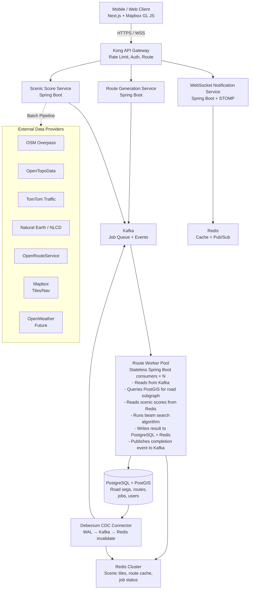
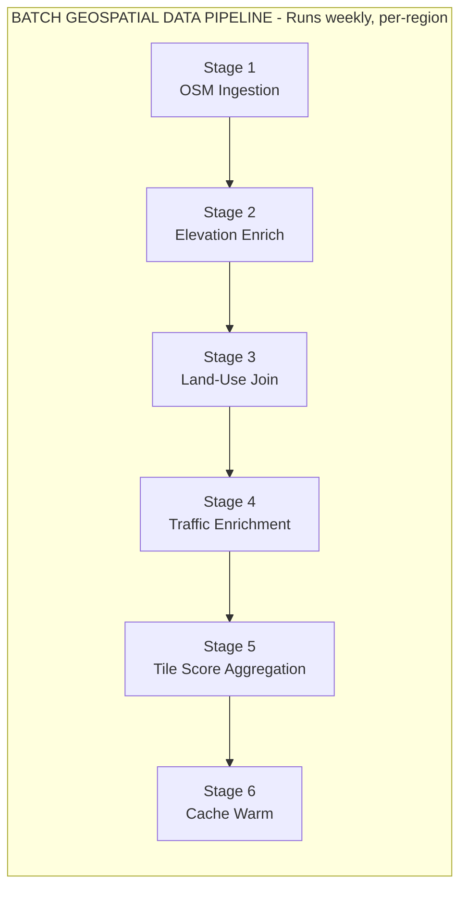
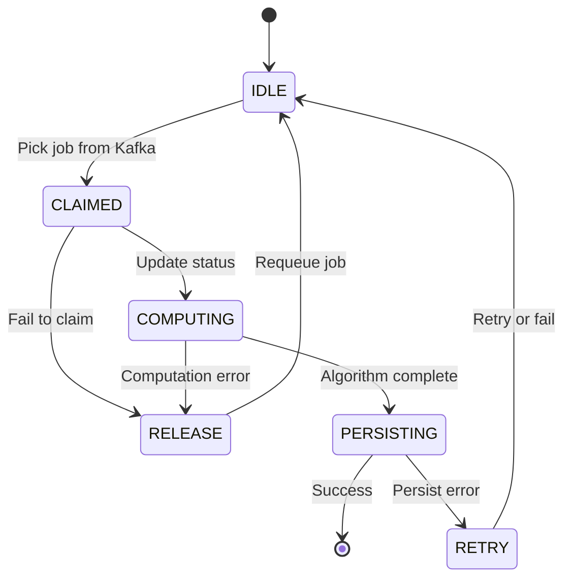
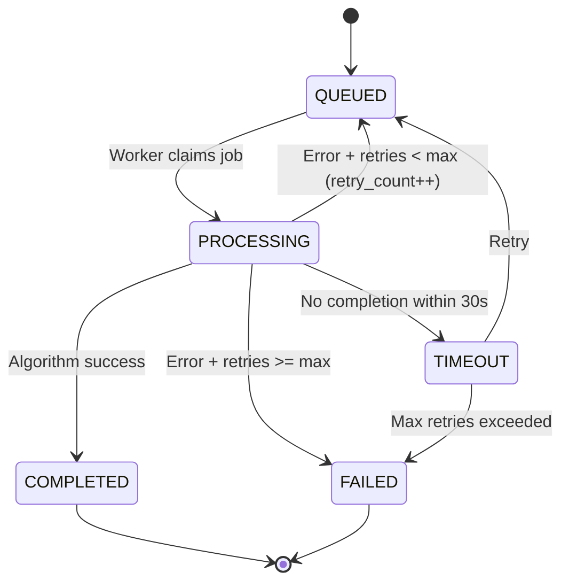
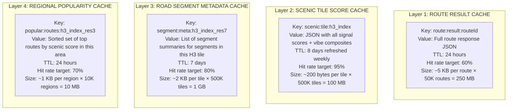
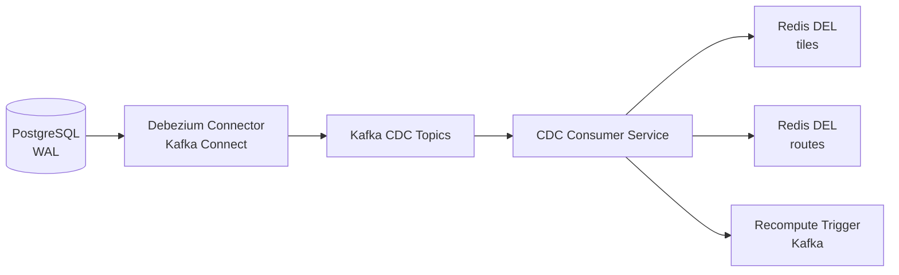
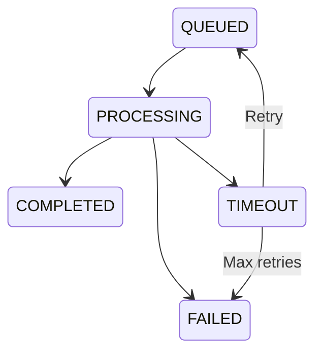
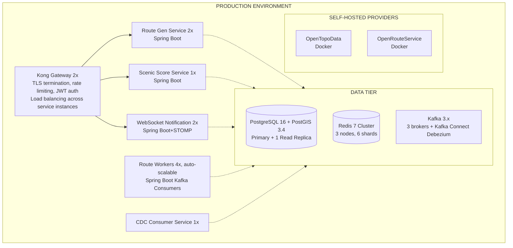

# MoodRide — Scenic Drive Route Generation Platform

## Engineering Specification Document

---

## 1. PRODUCT OVERVIEW

### Problem Statement

Every major navigation application — Google Maps, Waze, Apple Maps — optimizes for a single objective: **travel efficiency**. Fastest route, least traffic, shortest ETA. This is the correct optimization for commuters, delivery drivers, and travelers with fixed destinations. It is the **wrong optimization** for a large and entirely unserved category of driving: recreational, experiential, exploratory.

Millions of people take "Sunday drives" — aimless loops through countryside, coastal roads, or scenic backroads — with no destination in mind. They want to *feel something* while driving. Today, these users open Google Maps, stare at a road network with no scenic signal, guess at routes based on memory or word-of-mouth, and frequently end up on monotonous highways or dead-end roads. No product exists that accepts "I have 90 minutes and want a beautiful loop drive from where I am" and returns a high-quality, drivable circular route optimized for experience quality.

### Target Users

| Segment | Behavior | Need |
|---|---|---|
| Weekend leisure drivers | Drive 1–3 hours on weekends for relaxation | Discover scenic loops near home they've never driven |
| Motorcycle/enthusiast drivers | Seek curvy, low-traffic roads | Routes optimized for road curvature and traffic absence |
| Tourists in unfamiliar areas | Want to experience a region's landscape | Scenic routes without local knowledge |
| Photography enthusiasts | Seek visually compelling roads | Routes past water, elevation changes, open vistas |

### Why Existing Navigation Fails This Use Case

1. **No scenic objective function.** Navigation apps have no concept of "road quality for enjoyment." Their edge weights are time and distance — never land use, elevation change, water proximity, or road curvature.
2. **No circular route generation.** All major routing engines solve A→B shortest path. "Start here, end here, make it a 90-minute loop" is not a supported query.
3. **No vibe parameterization.** Users cannot express "I want coastal roads" or "I want open farmland with no traffic." There is no preference model for experiential driving.
4. **No precomputed scenic intelligence.** Scenic quality of a road segment requires fusing land-use classification, elevation profiles, water body proximity, traffic density, POI density, and road geometry. No consumer product has built this scoring layer.

### Core Product Insight

Scenic driving is an **inverted navigation problem**. Traditional routing minimizes cost (time/distance) between fixed endpoints. Scenic routing **maximizes reward (scenic quality)** over a **circular path** with a **time budget constraint** and **no fixed destination**. This inversion transforms the problem from shortest-path (polynomial) to a constrained reward-maximization over a graph (NP-hard), requiring fundamentally different algorithms, data pipelines, and system architecture.

### Concrete Scenario: The Sunday Drive

Sarah is in Portland, Oregon on a Sunday afternoon. She opens MoodRide, grants location access, selects **"90 minutes"** as her time budget, and taps **"Water & Mountains"** as her vibe. The app shows a loading animation for ~4 seconds, then renders a circular route: south along the Willamette River, through farmland to the Clackamas River canyon, up through forested elevation to a viewpoint, then back to Portland via a ridgeline road. Each segment is color-coded by scenic score. She taps "Start Drive" and gets turn-by-turn navigation along the scenic loop. After the drive, she rates it 4.5 stars. Next Sunday, her recommendations are better.

### What Makes This Technically Non-Trivial

1. **Constrained circular route optimization is NP-hard** — finding a time-bounded loop maximizing scenic score over a road graph is a variant of the Orienteering Problem (itself a generalization of TSP). Exact solutions are computationally infeasible for real road networks with millions of edges.
2. **Scenic scoring requires fusing 6+ heterogeneous geospatial data sources** at different update cadences (static road geometry, semi-static land use, near-real-time traffic). These cannot be joined at query time.
3. **Geospatial subgraph extraction** must retrieve all candidate road segments within a ~50 km radius in milliseconds, requiring spatial indexing over millions of segments.
4. **Asynchronous computation is mandatory** — route generation takes 2–10 seconds of CPU time. Mobile clients cannot block on synchronous HTTP for this duration.
5. **Multi-layer caching with correctness guarantees** — cached scenic scores, route results, and road segment data must be invalidated when underlying data changes, requiring CDC-driven invalidation.

---

## 2. SYSTEM GOALS

### Latency Targets

| Operation | Target (p50) | Target (p99) | Hard Limit |
|---|---|---|---|
| Route request submission (POST /routes) | 80 ms | 200 ms | 500 ms |
| Job status poll (GET /routes/{jobId}) | 15 ms | 50 ms | 100 ms |
| Route generation (async worker) | 3 s | 8 s | 15 s |
| WebSocket route completion notification | 50 ms after worker completes | 200 ms | 500 ms |
| Scenic region preview (GET /scenic-regions) | 100 ms | 300 ms | 500 ms |
| Route retrieval (GET /routes/{routeId}) | 20 ms (cache hit) | 100 ms (cache miss) | 300 ms |
| Map tile delivery for generated route | 200 ms | 500 ms | 1 s |

### Availability

- **API Gateway & Route Submission:** 99.9% (43.8 min/month downtime budget)
- **Route Generation Workers:** 99.5% (3.6 hrs/month) — degradation acceptable; users see "generating" state longer, not failures
- **Scenic Score Cache:** 99.9% — fallback to PostGIS on cache miss
- **Overall system:** 99.9% SLA for route submission, 99.5% for route generation completion within 15 seconds

### Scalability Expectations

| Dimension | MVP (v1) | Growth (v2) | Scale (v3) |
|---|---|---|---|
| Concurrent users | 1,000 | 50,000 | 1,000,000 |
| Route requests/day | 5,000 | 250,000 | 5,000,000 |
| Road segments indexed | 10M (1 metro) | 200M (US) | 2B (global) |
| Scenic score tiles | 500K | 20M | 500M |
| Worker pool size | 4 | 40 | 400 (multi-region) |

### Personalization Readiness

The v1 architecture must support future personalization without structural changes. This means:
- User behavior events (route completed, rating submitted, segment skipped) are emitted to Kafka from day one, even if no consumer processes them in v1.
- The user preference vector schema is defined in v1 (stored as JSONB in PostgreSQL), even if only populated with vibe tag selections.
- Route generation accepts an optional preference vector parameter that biases scenic score weights.

### Global Expansion Readiness

- Geospatial data pipeline is region-parameterized: data ingestion, scenic scoring, and cache partitioning are all scoped to configurable geographic regions.
- H3 hexagonal indexing (Uber's open-source system) used for geospatial partitioning, enabling seamless tiling across any geography.
- Land-use data sources are abstracted behind a provider interface: NLCD for US, CORINE for EU, custom adapters for other regions.

### Async Computation Expectations

- 100% of route generation requests are asynchronous. No synchronous route computation path exists.
- Clients receive a `jobId` immediately and are notified via WebSocket or poll for completion.
- Workers must be independently scalable — adding workers linearly increases throughput.

---

## 3. NON-GOALS (MVP BOUNDARIES)

The following are explicitly **out of scope for v1**:

| Non-Goal | Rationale |
|---|---|
| Real-time turn-by-turn navigation engine | Use Mapbox Navigation SDK on client. MoodRide generates the route geometry; navigation is delegated. |
| Multi-stop itinerary planning | MoodRide generates circular scenic loops, not multi-destination trip plans. |
| ML-based personalization | v1 uses vibe-tag-based preference vectors. ML preference learning is v2. |
| Route similarity / vector search | Route embeddings and Qdrant/pgvector integration deferred to v2. |
| User-generated content (photos, reviews) | No UGC in v1. Route ratings (1–5 stars) are the only user feedback. |
| Offline / downloadable routes | All route generation requires network. Offline map tiles deferred. |
| Multi-modal routes (cycling, walking) | Driving only in v1. |
| Real-time weather integration in scoring | Weather-aware routing is a future extension. Scenic scores are weather-agnostic in v1. |
| Monetization / subscription system | No payment infrastructure in v1. |
| Social features (shared routes, groups) | No social layer in v1. |
| Street-level imagery analysis (Mapillary) | Imagery-based scenic scoring is v2. v1 uses structured geospatial data only. |
| Multi-region deployment | Single-region deployment in v1. Architecture supports multi-region but not deployed. |
| Sunset/golden-hour-aware routing | Time-of-day scenic optimization is a future extension. |

---

## 4. USER EXPERIENCE FLOW

### Step-by-Step Lifecycle

```mermaid
flowchart TD
    A[1. OPEN APP] --> A1[App requests location permission]
    A1 --> A2[Location acquired lat, lng]
    A2 --> A3[App displays: time budget slider, vibe selector, Generate]
    
    A3 --> B[2. CONFIGURE ROUTE]
    B --> B1[User selects time budget: 30/60/90/120 min]
    B1 --> B2[User selects vibe: Coastal, Mountain, Countryside, Riverside, Forest, Open Roads]
    B2 --> B3[Optional: drag start pin to different location]
    B3 --> B4[Tap Generate Route]
    
    B4 --> C[3. ROUTE REQUEST SUBMITTED]
    C --> C1[POST /routes → returns jobId, status: QUEUED]
    C1 --> C2[App establishes WebSocket connection for jobId]
    C2 --> C3[App shows animated loading state with scenic facts]
    
    C3 --> D[4. ASYNC ROUTE GENERATION<br/>server-side, 2-8 seconds]
    D --> D1[Worker picks job from Kafka]
    D1 --> D2[Extracts geospatial subgraph from PostGIS]
    D2 --> D3[Reads scenic tile scores from Redis]
    D3 --> D4[Runs beam search optimization]
    D4 --> D5[Stores result in PostgreSQL + Redis]
    D5 --> D6[Publishes completion event]
    
    D6 --> E[5. ROUTE DELIVERED]
    E --> E1[WebSocket pushes type: ROUTE_READY, routeId]
    E1 --> E2[App fetches GET /routes/routeId]
    E2 --> E3[Receives: GeoJSON polyline, segment scenic scores,<br/>total distance, estimated duration, scenic highlights]
    E3 --> E4[Route rendered on Mapbox GL JS map]
    E4 --> E5[Segments color-coded: green high scenic → red low]
    
    E5 --> F[6. ROUTE PREVIEW]
    F --> F1[User sees route overview with:<br/>- Total scenic score 0-100<br/>- Distance and estimated duration<br/>- Scenic highlights<br/>- Mini-map with route polyline]
    F1 --> F2{User choice}
    F2 -->|Regenerate| B4
    F2 -->|Start Drive| G[7. DRIVE EXECUTION]
    
    G --> G1[Route geometry passed to Mapbox Navigation SDK]
    G1 --> G2[Turn-by-turn directions rendered]
    G2 --> G3[App tracks actual drive progress]
    
    G3 --> H[8. POST-DRIVE RATING]
    H --> H1[App prompts: How was your drive? 1-5 stars]
    H1 --> H2[Optional: What made it great? tag: views/roads/quiet]
    H2 --> H3[Rating event emitted to Kafka]
    H3 --> H4[Future: updates user preference vector]
```



### Future Personalization Loop (v2)

After 5+ rated drives:
- User preference vector updated by ML pipeline consuming Kafka events
- Route generation biases scenic weights toward learned preferences
- "Recommended For You" routes appear on home screen
- "Routes like the one you loved" powered by route embedding similarity search

---

## 5. HIGH-LEVEL SYSTEM ARCHITECTURE

### Component Diagram



### Service Responsibilities

| Service | Responsibility |
|---|---|
| **Kong API Gateway** | Authentication, rate limiting, request routing, TLS termination |
| **Route Generation Service** | Accepts route requests, creates jobs, returns job IDs, serves completed routes |
| **Scenic Score Service** | Manages scenic score tiles, serves regional scenic previews, triggers batch recomputation |
| **Route Worker Pool** | Stateless Kafka consumers that execute route generation algorithm |
| **WebSocket Notification Service** | Maintains client WebSocket connections, pushes route completion events |
| **PostgreSQL + PostGIS** | Persistent storage for road segments, scenic tiles, routes, jobs, user preferences |
| **Redis Cluster** | Scenic tile cache, route result cache, job status cache, regional popularity cache, pub/sub for WebSocket fan-out |
| **Kafka** | Job queue (route generation requests), behavior events (ratings, completions), CDC events (Debezium), completion notifications |
| **Debezium CDC Connector** | Monitors PostgreSQL WAL, publishes change events to Kafka for cache invalidation |
| **Geospatial Data Pipeline** | Batch service that ingests OSM, elevation, land-use, and traffic data; computes scenic tiles; writes to PostGIS |

### Full Request Lifecycle

1. **Client** sends `POST /routes` with `{ lat, lng, timeBudgetMinutes, vibes: ["coastal", "mountain"] }` through HTTPS.
2. **Kong API Gateway** validates JWT, checks rate limit (10 requests/min/user), forwards to Route Generation Service.
3. **Route Generation Service** validates input, creates a `route_job` record in PostgreSQL (status: `QUEUED`), publishes job message to Kafka topic `route.jobs.pending`, returns `{ jobId, status: "QUEUED" }` to client (< 200 ms).
4. **Client** opens WebSocket connection to Notification Service, subscribes to `job:{jobId}`.
5. **Route Worker** (one of N consumers on `route.jobs.pending`) picks up the job:
   - Updates job status to `PROCESSING` in PostgreSQL and Redis.
   - Queries PostGIS: `SELECT * FROM road_segments WHERE ST_DWithin(geom, ST_MakePoint(lng, lat), radius_m)` — extracts road subgraph within computed radius based on time budget.
   - Reads scenic tile scores from Redis for all H3 hexagons covering the subgraph area. Cache misses fall through to PostGIS.
   - Constructs weighted graph: edge weight = `(1 - normalized_scenic_score) * segment_travel_time`.
   - Runs beam search (K=10) to find circular routes satisfying time budget constraint (±10%).
   - Selects highest-scoring candidate route.
   - Writes `route` record to PostgreSQL (GeoJSON geometry, segment list, scores, metadata).
   - Writes route result to Redis cache (key: `route:{routeId}`, TTL: 24 hours).
   - Updates job status to `COMPLETED` in PostgreSQL and Redis.
   - Publishes completion event to Kafka topic `route.jobs.completed`.
6. **WebSocket Notification Service** consumes from `route.jobs.completed`, pushes `{ type: "ROUTE_READY", routeId }` to subscribed client.
7. **Client** fetches `GET /routes/{routeId}`, receives full route with GeoJSON, scenic scores per segment, and metadata.
8. **Client** renders route on Mapbox GL JS with scenic-score-based color gradient.

---

## 6. SERVICE-LEVEL ARCHITECTURE

### 6.1 Route Generation Service

| Aspect | Detail |
|---|---|
| **Responsibilities** | Accept route requests, validate inputs, create job records, serve completed routes, serve job status |
| **Inputs** | `{ lat, lng, timeBudgetMinutes, vibes[], preferenceVector? }` |
| **Outputs** | `{ jobId, status }` on submission; full route object on retrieval |
| **Data Dependencies** | PostgreSQL (jobs, routes), Redis (job status cache, route cache), Kafka (job publishing) |
| **Failure Handling** | If PostgreSQL is unavailable: return 503. If Kafka publish fails: retry 3× with exponential backoff, then store job in PostgreSQL-only fallback queue polled by workers. |
| **Scaling Strategy** | Stateless; horizontal scaling behind Kong load balancer. 2 instances minimum for availability. |
| **Tech** | Spring Boot 3.x, Spring WebFlux for non-blocking I/O, Spring Data JPA + PostGIS dialect |

### 6.2 Scenic Scoring Pipeline

| Aspect | Detail |
|---|---|
| **Responsibilities** | Compute and store scenic quality scores per H3 tile. Ingest and fuse geospatial data sources. Serve scenic region previews. |
| **Inputs** | OSM road data, NLCD/CORINE land-use data, OpenTopoData elevation, Natural Earth water/park polygons, TomTom traffic density |
| **Outputs** | `scenic_score_tile` records in PostGIS + Redis cache |
| **Data Dependencies** | External data providers (batch-fetched), PostgreSQL (write), Redis (cache write) |
| **Failure Handling** | If an external source fails during batch run: use last-known data for that signal, log degradation, emit metric `scenic.scoring.source_fallback`. If all sources fail: abort batch, retain existing scores. |
| **Scaling Strategy** | Batch job — scales vertically (larger instance) or horizontally by geographic partition (each worker scores a region). Runs weekly via scheduled Kubernetes CronJob or Spring `@Scheduled`. |
| **Tech** | Spring Boot batch service, GDAL for raster processing, H3-java for hex indexing |

### 6.3 Route Worker

| Aspect | Detail |
|---|---|
| **Responsibilities** | Consume route generation jobs from Kafka, execute beam search algorithm, write results |
| **Inputs** | Job message from Kafka: `{ jobId, lat, lng, timeBudgetMinutes, vibes[], preferenceVector? }` |
| **Outputs** | `route` record in PostgreSQL, route cache in Redis, completion event on Kafka |
| **Data Dependencies** | PostGIS (road segment subgraph), Redis (scenic tile scores), PostgreSQL (route/job writes) |
| **Failure Handling** | Worker crash mid-computation: Kafka consumer offset not committed → another worker retries. Job stuck > 30s: timeout watchdog marks as `FAILED`, eligible for retry (max 2 retries). Algorithm fails to find valid loop: return best partial result with `quality: "DEGRADED"` flag. |
| **Scaling Strategy** | Horizontal. Each worker is a stateless Kafka consumer in a consumer group. Adding workers increases throughput linearly. Target: 1 worker per 2 concurrent route computations. Auto-scale on Kafka consumer lag metric. |
| **Tech** | Spring Boot, Spring Kafka, JGraphT for graph operations, H3-java |

### 6.4 Cache Layer

| Aspect | Detail |
|---|---|
| **Responsibilities** | Serve cached scenic tile scores, cached route results, cached road segment metadata, regional popularity data |
| **Inputs** | Read requests from Route Workers, Route Generation Service, Scenic Score Service |
| **Outputs** | Cached objects or cache miss signal |
| **Data Dependencies** | Redis Cluster (primary), PostgreSQL (fallback on miss) |
| **Failure Handling** | Redis unavailable: all reads fall through to PostgreSQL. Circuit breaker on Redis client (Resilience4j) — opens after 5 failures in 10s, half-open after 30s. Performance degrades (higher latency) but system remains functional. |
| **Scaling Strategy** | Redis Cluster with hash-slot-based sharding. Scenic tiles partitioned by H3 index prefix. Route cache partitioned by routeId hash. |
| **Tech** | Redis 7.x Cluster, Lettuce client (async, non-blocking) |

### 6.5 CDC Invalidation Service

| Aspect | Detail |
|---|---|
| **Responsibilities** | Consume Debezium CDC events from Kafka, invalidate stale Redis cache entries, trigger downstream recomputation when scenic tiles change |
| **Inputs** | Kafka CDC events from `dbserver.public.scenic_score_tile` and `dbserver.public.road_segments` topics |
| **Outputs** | Redis DEL commands for invalidated keys, recomputation trigger messages on `scenic.recompute.requests` topic |
| **Data Dependencies** | Kafka (CDC events), Redis (invalidation target) |
| **Failure Handling** | If Redis invalidation fails: log and retry. Worst case: stale cache entry served until TTL expiry. If Kafka consumer falls behind: alert on consumer lag > 1000 events. |
| **Scaling Strategy** | Lightweight service; single instance sufficient for v1. Partition by CDC topic partition for horizontal scaling. |
| **Tech** | Spring Boot, Spring Kafka consumer, Lettuce Redis client |

### 6.6 Map Rendering Integration Layer

| Aspect | Detail |
|---|---|
| **Responsibilities** | Serve route GeoJSON optimized for Mapbox GL JS rendering, provide scenic-score-colored polyline style, manage map tile prefetch hints |
| **Inputs** | Route geometry from Route Generation Service |
| **Outputs** | Styled GeoJSON with per-segment scenic color coding, tile prefetch URL list |
| **Data Dependencies** | Route cache (Redis), Mapbox Tiles API |
| **Failure Handling** | If Mapbox tile API is unavailable: fall back to OpenStreetMap raster tiles with degraded styling. |
| **Scaling Strategy** | Stateless; scales horizontally. CDN-cacheable tile prefetch responses. |
| **Tech** | Integrated into Route Generation Service as a module (not a separate deployment in v1) |

### 6.7 WebSocket Notification Service

| Aspect | Detail |
|---|---|
| **Responsibilities** | Maintain WebSocket connections with clients, consume route completion events from Kafka, push notifications to subscribed clients |
| **Inputs** | Kafka completion events: `{ jobId, routeId, status }` |
| **Outputs** | WebSocket messages to clients: `{ type: "ROUTE_READY", routeId }` or `{ type: "ROUTE_FAILED", reason }` |
| **Data Dependencies** | Kafka (completion events), Redis Pub/Sub (for multi-instance fan-out) |
| **Failure Handling** | Client disconnects: clean up subscription. Client reconnects: client polls `GET /routes/{jobId}` for current status (idempotent). Multiple notification service instances: use Redis Pub/Sub to fan out completion events to the instance holding the client's WebSocket. |
| **Scaling Strategy** | Horizontal with sticky sessions (by jobId hash) or Redis Pub/Sub fan-out. Each instance handles ~10K concurrent WebSocket connections. |
| **Tech** | Spring Boot, Spring WebSocket + STOMP, Redis Pub/Sub |

### 6.8 Personalization Event Pipeline (Future-Ready)

| Aspect | Detail |
|---|---|
| **Responsibilities** | (v2) Consume user behavior events, update preference vectors, generate personalized route recommendations |
| **v1 Readiness** | Kafka topics `user.events.drive_completed`, `user.events.route_rated` are created and populated by the Route Generation Service. No consumer in v1. User preference vector stored as vibe-tag-based JSONB in PostgreSQL. |
| **Future Inputs** | Kafka events: drive completion, route rating, segment-level engagement signals |
| **Future Outputs** | Updated `user_preference_vector` in PostgreSQL, personalized route recommendations |
| **Tech (Future)** | Spring Boot Kafka Streams or Flink, vector database (pgvector or Qdrant) for route similarity |

---

## 7. DATA MODEL SPECIFICATION

### 7.1 `road_segment`

```sql
CREATE TABLE road_segment (
    id              BIGSERIAL PRIMARY KEY,
    osm_way_id      BIGINT NOT NULL,
    geom            GEOMETRY(LINESTRING, 4326) NOT NULL,
    h3_index_res7   TEXT NOT NULL,          -- H3 hex index at resolution 7 (~5.16 km² per hex)

    -- Road Classification
    highway_type    TEXT NOT NULL,           -- 'motorway','trunk','primary','secondary','tertiary','residential','unclassified','track'
    surface_type    TEXT,                    -- 'asphalt','gravel','unpaved','cobblestone'
    road_name       TEXT,
    speed_limit_kmh SMALLINT,

    -- Geometric Properties
    length_m        DOUBLE PRECISION NOT NULL,
    curvature_score REAL NOT NULL DEFAULT 0, -- 0.0 (straight) to 1.0 (very curvy), computed from geometry
    avg_elevation_m REAL,
    elevation_gain_m REAL,

    -- Scenic Signals (denormalized from tile scores for fast per-segment access)
    land_use_class  TEXT,                   -- 'forest','farmland','water','urban','industrial','park','wetland'
    water_proximity_m REAL,                 -- distance to nearest water body in meters, NULL if > 5000m
    poi_density     REAL DEFAULT 0,         -- POIs per km within 500m buffer

    -- Travel Time
    estimated_travel_time_s INTEGER NOT NULL, -- based on speed_limit or road type default

    -- Metadata
    last_updated    TIMESTAMPTZ NOT NULL DEFAULT NOW(),
    data_source     TEXT NOT NULL DEFAULT 'osm',

    CONSTRAINT chk_curvature CHECK (curvature_score >= 0 AND curvature_score <= 1)
);

-- Geospatial index: critical for subgraph extraction queries
CREATE INDEX idx_road_segment_geom ON road_segment USING GIST (geom);

-- H3 index: for tile-based scenic score lookups and cache partitioning
CREATE INDEX idx_road_segment_h3 ON road_segment (h3_index_res7);

-- Highway type: for filtering by road class during route generation
CREATE INDEX idx_road_segment_highway ON road_segment (highway_type);

-- Composite: geospatial + highway type for optimized subgraph extraction
CREATE INDEX idx_road_segment_geom_highway ON road_segment USING GIST (geom)
    WHERE highway_type NOT IN ('motorway', 'motorway_link');
```

### 7.2 `scenic_score_tile`

```sql
CREATE TABLE scenic_score_tile (
    id                  BIGSERIAL PRIMARY KEY,
    h3_index            TEXT NOT NULL UNIQUE,    -- H3 hex ID at resolution 7
    h3_resolution       SMALLINT NOT NULL DEFAULT 7,
    center_lat          DOUBLE PRECISION NOT NULL,
    center_lng          DOUBLE PRECISION NOT NULL,
    geom                GEOMETRY(POLYGON, 4326) NOT NULL, -- hex boundary for spatial queries

    -- Individual Signal Scores (0.0 to 1.0, pre-normalized)
    land_use_score      REAL NOT NULL DEFAULT 0.5,  -- forest/park = 1.0, industrial = 0.0
    elevation_score     REAL NOT NULL DEFAULT 0.5,  -- high variance = 1.0, flat = 0.3
    water_proximity_score REAL NOT NULL DEFAULT 0.0, -- within 200m of water = 1.0, >5km = 0.0
    traffic_density_score REAL NOT NULL DEFAULT 0.5, -- low traffic = 1.0, congested = 0.0
    road_curvature_score  REAL NOT NULL DEFAULT 0.5, -- curvy roads = 1.0, straight highways = 0.2
    poi_density_score   REAL NOT NULL DEFAULT 0.3,  -- scenic POIs nearby = 1.0, none = 0.0

    -- Composite Scores (pre-computed weighted aggregates per vibe)
    composite_score     REAL NOT NULL DEFAULT 0.5,  -- default vibe aggregate
    coastal_score       REAL NOT NULL DEFAULT 0.5,  -- vibe-specific: heavy water weight
    mountain_score      REAL NOT NULL DEFAULT 0.5,  -- vibe-specific: heavy elevation weight
    countryside_score   REAL NOT NULL DEFAULT 0.5,  -- vibe-specific: heavy land_use weight
    forest_score        REAL NOT NULL DEFAULT 0.5,  -- vibe-specific: heavy forest land_use
    open_roads_score    REAL NOT NULL DEFAULT 0.5,  -- vibe-specific: heavy curvature + low traffic

    -- Metadata
    computed_at         TIMESTAMPTZ NOT NULL DEFAULT NOW(),
    data_sources_used   TEXT[] NOT NULL DEFAULT '{}', -- ['osm','nlcd','opentopo','tomtom']
    confidence          REAL NOT NULL DEFAULT 1.0,    -- 1.0 = all sources available, <1.0 = fallback used

    CONSTRAINT chk_scores CHECK (
        composite_score >= 0 AND composite_score <= 1 AND
        land_use_score >= 0 AND land_use_score <= 1
    )
);

-- Geospatial index for spatial queries
CREATE INDEX idx_scenic_tile_geom ON scenic_score_tile USING GIST (geom);

-- H3 lookup (primary access pattern)
CREATE INDEX idx_scenic_tile_h3 ON scenic_score_tile (h3_index);

-- Composite score for "best scenic regions" queries
CREATE INDEX idx_scenic_tile_composite ON scenic_score_tile (composite_score DESC);
```

### 7.3 `route`

```sql
CREATE TABLE route (
id                  UUID PRIMARY KEY DEFAULT gen_random_uuid(),
job_id              UUID NOT NULL REFERENCES route_job(id),

    -- Route Geometry
    geom                GEOMETRY(LINESTRING, 4326) NOT NULL,
    geom_geojson        JSONB NOT NULL,           -- pre-serialized GeoJSON for API response
    segment_ids         BIGINT[] NOT NULL,         -- ordered list of road_segment IDs
    segment_scores      REAL[] NOT NULL,           -- parallel array: scenic score per segment

    -- Route Properties
    total_distance_m    DOUBLE PRECISION NOT NULL,
    estimated_duration_s INTEGER NOT NULL,
    scenic_score        REAL NOT NULL,             -- aggregate route scenic score (0-100)
    scenic_highlights   JSONB NOT NULL DEFAULT '[]', -- e.g. [{"type":"waterfront","segment_range":[12,18],"description":"Columbia River stretch"}]

    -- Request Parameters (denormalized for cache key construction)
    start_lat           DOUBLE PRECISION NOT NULL,
    start_lng           DOUBLE PRECISION NOT NULL,
    time_budget_minutes INTEGER NOT NULL,
    vibes               TEXT[] NOT NULL,

    -- Quality Metadata
    quality_tier        TEXT NOT NULL DEFAULT 'STANDARD', -- 'PREMIUM', 'STANDARD', 'DEGRADED'
    algorithm_version   TEXT NOT NULL DEFAULT 'beam_v1',
    beam_candidates     INTEGER NOT NULL DEFAULT 10,
    computation_time_ms INTEGER NOT NULL,

    -- Lifecycle
    created_at          TIMESTAMPTZ NOT NULL DEFAULT NOW(),
    expires_at          TIMESTAMPTZ NOT NULL DEFAULT NOW() + INTERVAL '7 days',

    -- User Feedback (nullable, updated post-drive)
    user_rating         SMALLINT,                  -- 1-5 stars
    rated_at            TIMESTAMPTZ
);

CREATE INDEX idx_route_job ON route (job_id);
CREATE INDEX idx_route_geom ON route USING GIST (geom);
CREATE INDEX idx_route_start ON route USING GIST (ST_MakePoint(start_lng, start_lat));
CREATE INDEX idx_route_created ON route (created_at DESC);
```

### 7.4 `route_job`

```sql
CREATE TABLE route_job (
    id                  UUID PRIMARY KEY DEFAULT gen_random_uuid(),
    user_id             UUID,                      -- nullable for anonymous users in v1

    -- Request Parameters
    start_lat           DOUBLE PRECISION NOT NULL,
    start_lng           DOUBLE PRECISION NOT NULL,
    time_budget_minutes INTEGER NOT NULL,
    vibes               TEXT[] NOT NULL,
    preference_vector   JSONB,                     -- future: user preference weights

    -- Job State Machine
    status              TEXT NOT NULL DEFAULT 'QUEUED',
    -- QUEUED → PROCESSING → COMPLETED | FAILED | TIMEOUT

    -- Execution Tracking
    worker_id           TEXT,                      -- which worker instance processed this
    queued_at           TIMESTAMPTZ NOT NULL DEFAULT NOW(),
    started_at          TIMESTAMPTZ,
    completed_at        TIMESTAMPTZ,
    failed_at           TIMESTAMPTZ,
    failure_reason      TEXT,
    retry_count         SMALLINT NOT NULL DEFAULT 0,
    max_retries         SMALLINT NOT NULL DEFAULT 2,

    -- Result Reference
    route_id            UUID REFERENCES route(id),

    CONSTRAINT chk_status CHECK (status IN ('QUEUED','PROCESSING','COMPLETED','FAILED','TIMEOUT')),
    CONSTRAINT chk_time_budget CHECK (time_budget_minutes >= 15 AND time_budget_minutes <= 240)
);

CREATE INDEX idx_job_status ON route_job (status) WHERE status IN ('QUEUED', 'PROCESSING');
CREATE INDEX idx_job_user ON route_job (user_id, created_at DESC) WHERE user_id IS NOT NULL;
```

### 7.5 `user_preference_vector` (Future-Ready)

```sql
CREATE TABLE user_preference_vector (
user_id             UUID PRIMARY KEY,

    -- Vibe Affinity Weights (initialized from vibe tag selection, updated by ML pipeline)
    coastal_affinity    REAL NOT NULL DEFAULT 0.5,
    mountain_affinity   REAL NOT NULL DEFAULT 0.5,
    countryside_affinity REAL NOT NULL DEFAULT 0.5,
    forest_affinity     REAL NOT NULL DEFAULT 0.5,
    open_roads_affinity REAL NOT NULL DEFAULT 0.5,
    riverside_affinity  REAL NOT NULL DEFAULT 0.5,

    -- Behavioral Signals
    avg_preferred_duration_min REAL,            -- learned from actual drive durations
    avg_rating          REAL,
    total_drives        INTEGER NOT NULL DEFAULT 0,

    -- Raw Vector (for ML pipeline)
    embedding           REAL[],                 -- v2: dense preference vector from ML model

    -- Metadata
    created_at          TIMESTAMPTZ NOT NULL DEFAULT NOW(),
    updated_at          TIMESTAMPTZ NOT NULL DEFAULT NOW(),
    model_version       TEXT NOT NULL DEFAULT 'vibe_tags_v1'
);
```

## 8. GEOSPATIAL DATA PIPELINE DESIGN

### Pipeline Architecture



### Stage 1: OSM Road Network Ingestion

**Source:** OpenStreetMap Overpass API (or OSM PBF extract files for bulk ingestion)

**Process:**
1. Download regional PBF extract from Geofabrik (e.g., `us-west-latest.osm.pbf`).
2. Parse with `osmosis` or `osm4j` Java library — extract all `way` elements with `highway=*` tag.
3. For each way, extract: geometry (lat/lng nodes), highway type, surface, name, maxspeed, lanes.
4. Compute derived properties:
   - **Curvature score:** Calculate angle change per unit distance along the way geometry. Normalize to [0, 1] where 1 = highly curvy. 
     - Formula: `curvature = sum(abs(bearing_change_i)) / length_m`, then min-max normalize across the dataset.
   - **Segment travel time:** `length_m / (speed_limit_kmh * 1000 / 3600)`. Default speeds by road type if no speed limit tagged.
5. Compute H3 index at resolution 7 for each segment's centroid.
6. Upsert into `road_segment` table via batch INSERT with `ON CONFLICT (osm_way_id) DO UPDATE`.

**Volume:** ~2M road segments per US state. Full US: ~50M segments.

**Duration:** ~2 hours for a single US state on a 4-core machine.

### Stage 2: Elevation Enrichment

**Source:** OpenTopoData API (self-hostable) or SRTM 30m raster data.

**Process:**
1. For each road segment, sample elevation at 10 equidistant points along its geometry.
2. Compute `avg_elevation_m` and `elevation_gain_m` (sum of positive elevation changes).
3. Batch queries to OpenTopoData: POST up to 100 points per request.
4. Rate limit: 1 request/second for public API; unlimited for self-hosted.
5. **Fallback:** If OpenTopoData is unavailable, use previously stored elevation data. For segments with no elevation data, assign `elevation_score = 0.5` (neutral).

### Stage 3: Land-Use Classification Join

**Source:** NLCD (US) at 30m resolution, CORINE (EU), or OSM `landuse=*` tags globally.

**Process:**
1. For each H3 tile at resolution 7, query the dominant land-use class within the hex boundary.
2. NLCD raster: use GDAL `gdalwarp` to clip raster to hex boundary, count pixels by class, assign dominant class.
3. Classification mapping:

| NLCD Code | Class | Scenic Value |
|---|---|---|
| 11 | Open Water | 1.0 |
| 41, 42, 43 | Forest (Deciduous/Evergreen/Mixed) | 0.9 |
| 81 | Pasture/Hay | 0.7 |
| 71 | Grassland | 0.7 |
| 90, 95 | Wetlands | 0.8 |
| 21 | Developed, Open Space | 0.4 |
| 22 | Developed, Low Intensity | 0.3 |
| 23, 24 | Developed, Medium/High Intensity | 0.1 |
| 31 | Barren Land | 0.3 |
| 82 | Cultivated Crops | 0.5 |

4. Also compute `water_proximity_m` for each road segment using PostGIS `ST_Distance` to nearest water body polygon from Natural Earth dataset.
5. Compute `poi_density`: count scenic POIs (OSM `tourism=*`, `leisure=park`, `natural=*`) within 500m buffer of each segment.

### Stage 4: Traffic Density Enrichment

**Source:** TomTom Traffic Flow API (free tier: 2,500 requests/day).

**Process:**
1. For each H3 tile, query TomTom for average traffic flow on major roads within the tile.
2. Due to rate limits, prioritize tiles containing primary and secondary roads.
3. Compute `traffic_density_score`: `1.0 - (current_speed / free_flow_speed)`. Low ratio = low traffic = high score.
4. Tiles without traffic data: assign `traffic_density_score = 0.5` (neutral).
5. **Rate Limit Management:** Queue traffic API requests through a token bucket rate limiter. Process over multiple days if needed for initial bulk ingestion.

### Stage 5: Tile-Level Scenic Score Aggregation

**Process:**
1. For each H3 tile, compute all six signal scores based on enriched data.
2. Compute composite and vibe-specific scores using the scenic scoring formula (Section 9).
3. Assign confidence score: 1.0 if all data sources contributed, reduced by 0.15 per missing source.
4. Upsert into `scenic_score_tile` table.

### Stage 6: Cache Warming

**Process:**
1. After tile scores are computed, push all tiles to Redis: key = `scenic:tile:{h3_index}`, value = serialized tile scores, TTL = 8 days (> 7-day refresh cycle).
2. For top-1000 tiles by composite score, also populate `scenic:region:top` sorted set for scenic region preview API.

### Weekly Refresh Strategy

- **Schedule:** Every Sunday 02:00 UTC.
- **Incremental:** Re-fetch OSM changesets (OsmChange format) since last run. Re-process only affected tiles.
- **Full rebuild:** Monthly full rebuild to catch any drift.
- **Monitoring:** Alert if pipeline fails to complete within 6 hours. Alert if > 5% of tiles show > 20% score change (indicates data quality issue).

### Fallback Scoring for Unknown Regions

When a user requests a route in a region with no precomputed scenic tiles:
1. Route Worker detects missing tiles (Redis + PostGIS miss).
2. Falls back to **real-time lightweight scoring**: query OSM road tags only (highway type, surface), assign scores from a lookup table based on road type alone.
3. Route generated with `quality_tier = "DEGRADED"` and `confidence < 0.5`.
4. Trigger background job to ingest and score that region's tiles for next request.

## 9. SCENIC SCORING ALGORITHM

### Formula

The scenic score for an H3 tile is a weighted linear combination of normalized signal scores:

```
S_composite = w_lu * S_landuse
            + w_el * S_elevation
            + w_wp * S_water_proximity
            + w_td * S_traffic_density
            + w_rc * S_road_curvature
            + w_pd * S_poi_density
```

### Default Weights (composite / "balanced" vibe)

| Signal | Weight | Justification |
|---|---|---|
| w_lu (Land Use) | 0.30 | Dominant factor: forest/water vs. industrial determines scenic quality more than any other signal. |
| w_el (Elevation) | 0.15 | Elevation variance adds visual interest; flat terrain is less engaging. |
| w_wp (Water Proximity) | 0.20 | Water bodies are consistently rated as scenic by humans across cultures. |
| w_td (Traffic Density) | 0.15 | Inverse traffic: quiet roads are part of the scenic experience. |
| w_rc (Road Curvature) | 0.10 | Curvy roads provide a more engaging driving experience. |
| w_pd (POI Density) | 0.10 | Scenic POIs (viewpoints, parks, landmarks) add discovery value. |

**Weights sum to 1.0.** All signal scores are in [0.0, 1.0]. Composite score is in [0.0, 1.0].

### Vibe-Specific Weight Overrides

| Signal | Coastal | Mountain | Countryside | Forest | Open Roads | Riverside |
|---|---|---|---|---|---|---|
| Land Use | 0.20 | 0.20 | 0.35 | 0.40 | 0.15 | 0.20 |
| Elevation | 0.10 | 0.35 | 0.10 | 0.15 | 0.10 | 0.10 |
| Water Proximity | 0.40 | 0.10 | 0.10 | 0.05 | 0.05 | 0.40 |
| Traffic Density | 0.10 | 0.15 | 0.20 | 0.15 | 0.25 | 0.10 |
| Road Curvature | 0.10 | 0.15 | 0.10 | 0.10 | 0.35 | 0.10 |
| POI Density | 0.10 | 0.05 | 0.15 | 0.15 | 0.10 | 0.10 |

When a user selects multiple vibes, the scores are averaged: `S_route_vibe = avg(S_vibe_1, S_vibe_2)`.

### Normalization Strategy

Each signal is normalized to [0.0, 1.0] using the following methods:

| Signal | Method | Detail |
|---|---|---|
| Land Use | Categorical mapping | Direct lookup table (Section 8, Stage 3). Forest → 0.9, Urban-High → 0.1. |
| Elevation | Regional percentile normalization | S_el = percentile_rank(elevation_variance, region). The elevation variance of a tile is ranked against all tiles in its region (US state or country). This avoids penalizing flat states. |
| Water Proximity | Exponential decay | S_wp = exp(-distance_m / 500). 0m → 1.0, 500m → 0.37, 2000m → 0.018, >3000m → ~0.0. |
| Traffic Density | Inverse ratio | S_td = actual_speed / free_flow_speed. High ratio = free flow = high scenic score. |
| Road Curvature | Log-scaled bearing change | S_rc = min(1.0, log(1 + total_bearing_change_deg / length_km) / log(50)). Captures that moderate curvature is pleasant; extreme curvature has diminishing returns. |
| POI Density | Log-scaled count | S_pd = min(1.0, log(1 + poi_count) / log(20)). Diminishing returns beyond ~20 POIs per tile. |

### Data Fusion Method

The scoring pipeline fuses heterogeneous data at the tile level, not at query time:

1. **Spatial alignment:** All data sources are projected onto the same H3 tile grid (resolution 7). Each tile is ~5.16 km² — large enough to be meaningful for driving, small enough for route-level granularity.
2. **Temporal alignment:** Each signal has its own update cadence. The tile score records `data_sources_used` and `computed_at` so that the freshness of each component is trackable.
3. **Confidence weighting:** If a data source was unavailable during computation, the tile's `confidence` field is reduced. Route generation can filter or penalize low-confidence tiles.

### Cache Storage Strategy

- **Redis key format:** `scenic:tile:{h3_index}` → JSON blob with all signal scores and vibe-specific composites.
- **Redis data structure:** String (serialized JSON). ~200 bytes per tile.
- **TTL:** 8 days (pipeline refreshes weekly; 1-day buffer).
- **Access pattern:** Route workers read tiles in bulk using `MGET scenic:tile:{h3_1} scenic:tile:{h3_2} ...` — single round trip for all tiles covering a route's geographic area.

### Refresh Triggers

1. **Scheduled:** Weekly batch pipeline recomputes all tiles.
2. **CDC-driven:** If `road_segment` or `scenic_score_tile` rows are updated in PostgreSQL, Debezium emits change events that invalidate corresponding Redis cache entries.
3. **User-feedback-driven (v2):** If a route segment receives consistently low ratings (avg < 2.0 over 5+ ratings), trigger re-scoring of constituent tiles.

### Why Scoring Must Be Precomputed

A single route generation queries scenic scores for 50–200 H3 tiles (covering a ~50km radius). If each tile score required real-time queries to 6 external data sources:

- 200 tiles × 6 sources = **1,200 external API calls per route request**.
- At ~100ms per call with parallelization, this adds **10–30 seconds** to route generation.
- External API rate limits (TomTom: 2,500/day, OpenTopoData: 1/sec) make this impossible at any meaningful user volume.

**Precomputed tile scores reduce route-time scenic data access to a single Redis MGET call (~5ms).** This is the single most important architectural decision in the system.
 
10. ROUTE GENERATION ALGORITHM
Problem Formulation
Given:
Start point P = (lat, lng)
Time budget T (minutes, ±10% tolerance)
Vibe preferences V = [v_1, v_2, ...]
Road network graph G = (segments, intersections) within radius R of P
Scenic score function score(segment, V) → [0, 1]
Find:
A circular path C starting and ending at the node nearest to P
Such that |travel_time(C) - T| ≤ 0.10 * T
That maximizes total_scenic_score(C) = Σ score(segment_i, V) * length(segment_i) for all segments in C
Why Exact Optimization Is Infeasible
This is a variant of the Orienteering Problem (OP), itself a generalization of the Travelling Salesman Problem (TSP). The Orienteering Problem asks: given a graph with node profits and edge travel times, find a path of bounded length that maximizes total profit. Adding the circular constraint (start = end) makes it the Team Orienteering Problem with Time Windows variant.
The OP is NP-hard (proven by reduction from the knapsack problem).
For a road subgraph with 10,000–50,000 segments (typical for a 50km radius in a metro area), exact solutions via integer linear programming would require hours of compute.
Even with cutting-edge solvers (Gurobi, CPLEX), the solution time for graphs of this size exceeds 60 seconds — unacceptable for a consumer product.
Chosen Algorithm: Beam Search with Time-Budget Pruning
Why beam search over alternatives:
Algorithm
Pros
Cons
Decision
Beam search (K=10)
O(K × N × log N) per expansion; naturally prunes infeasible paths; produces K diverse candidates
May miss globally optimal; requires good heuristic
Selected
Simulated annealing
Good for continuous optimization
Poor for discrete graph problems with hard constraints; slow convergence on constrained loops
Rejected
Genetic algorithms
Good diversity
Expensive per generation; hard to enforce circular constraint
## 10. ROUTE GENERATION ALGORITHM

### Problem Formulation

**Given:**
- Start point P = (lat, lng)
- Time budget T (minutes, ±10% tolerance)
- Vibe preferences V = [v_1, v_2, ...]
- Road network graph G = (segments, intersections) within radius R of P
- Scenic score function `score(segment, V) → [0, 1]`

**Find:**
- A circular path C starting and ending at the node nearest to P
- Such that `|travel_time(C) - T| ≤ 0.10 * T`
- That maximizes `total_scenic_score(C) = Σ score(segment_i, V) * length(segment_i)` for all segments in C

### Why Exact Optimization Is Infeasible

This is a variant of the **Orienteering Problem (OP)**, itself a generalization of the Travelling Salesman Problem (TSP). The Orienteering Problem asks: given a graph with node profits and edge travel times, find a path of bounded length that maximizes total profit. Adding the circular constraint (start = end) makes it the **Team Orienteering Problem with Time Windows** variant.

- The OP is **NP-hard** (proven by reduction from the knapsack problem).
- For a road subgraph with 10,000–50,000 segments (typical for a 50km radius in a metro area), exact solutions via integer linear programming would require hours of compute.
- Even with cutting-edge solvers (Gurobi, CPLEX), the solution time for graphs of this size exceeds 60 seconds — unacceptable for a consumer product.

### Chosen Algorithm: Beam Search with Time-Budget Pruning

**Why beam search over alternatives:**

| Algorithm | Pros | Cons | Decision |
|---|---|---|---|
| Beam search (K=10) | O(K × N × log N) per expansion; naturally prunes infeasible paths; produces K diverse candidates | May miss globally optimal; requires good heuristic | **Selected** |
| Simulated annealing | Good for continuous optimization | Poor for discrete graph problems with hard constraints; slow convergence on constrained loops | Rejected |
| Genetic algorithms | Good diversity | Expensive per generation; hard to enforce circular constraint | Rejected |
| Greedy heuristic | Fast | Poor quality; gets trapped in local optima | Rejected |
| Dijkstra/A* | Optimal for shortest path | Cannot maximize reward on loops; wrong problem formulation | Rejected |

### Algorithm Detail

```pseudocode
BEAM_SEARCH_SCENIC_LOOP(start, T_budget, vibes, K=10):

    // Phase 1: Subgraph Extraction
    R_km = estimate_radius(T_budget)  // T/2 * avg_speed * 0.6 (accounting for loop inefficiency)
    subgraph = PostGIS.query("SELECT * FROM road_segment
                              WHERE ST_DWithin(geom, start, R_km * 1000)
                              AND highway_type NOT IN ('motorway', 'motorway_link')")
    scenic_tiles = Redis.MGET(h3_indices_covering(subgraph))

    // Phase 2: Graph Construction
    G = build_adjacency_graph(subgraph)
    for each edge e in G:
        e.scenic_score = scenic_tiles[e.h3_index].vibe_score(vibes)
        e.travel_time = e.estimated_travel_time_s
        e.reward = e.scenic_score * e.length_m  // length-weighted scenic reward

    // Phase 3: Outward Beam Search
    T_half = T_budget * 60 / 2  // half budget in seconds (outward leg)
    beam = [{path: [start_node], time: 0, reward: 0}] × 1 (initial state)

    for step in 1..MAX_STEPS:
        candidates = []
        for state in beam:
            for neighbor in G.neighbors(state.path[-1]):
                edge = G.edge(state.path[-1], neighbor)
                new_time = state.time + edge.travel_time

                // Pruning: can we still return to start within budget?
                return_time = estimate_return_time(neighbor, start, G)
                if new_time + return_time > T_budget * 60 * 1.10:
                    continue  // prune: would exceed time budget
                if new_time > T_half * 1.2:
                    continue  // prune: too far on outward leg
                if neighbor in state.path:
                    continue  // avoid revisiting (soft constraint)

                candidates.append({
                    path: state.path + [neighbor],
                    time: new_time,
                    reward: state.reward + edge.reward
                })

        // Beam selection: keep top K by reward / time ratio
        beam = top_k(candidates, K, key=lambda c: c.reward / max(c.time, 1))

        if all candidates pruned:
            break

    // Phase 4: Return Leg Completion
    complete_routes = []
    for state in beam:
        return_path = A_star_scenic(state.path[-1], start, G, weight='scenic')
        full_route = state.path + return_path
        total_time = state.time + travel_time(return_path)
        total_reward = state.reward + scenic_reward(return_path)

        if abs(total_time - T_budget * 60) <= T_budget * 60 * 0.10:
            complete_routes.append({route: full_route, time: total_time, reward: total_reward})

    // Phase 5: Select Best
    if complete_routes is empty:
        // Fallback: find ANY valid loop, score it
        complete_routes = [fallback_loop(start, T_budget, G)]

    return max(complete_routes, key=lambda r: r.reward)
```

**Helper functions:**
- `estimate_return_time`: Uses straight-line distance to start / average road speed as a lower-bound heuristic. Fast to compute, ensures we don't explore paths that can't possibly return in time.
- `A_star_scenic`: A* from the beam endpoint back to start, with edge cost = `(1 - scenic_score) * travel_time`. This finds a return path that is both efficient (returns to start) and scenic (prefers high-score segments).

### Performance Expectations

| Metric | Value |
|---|---|
| Subgraph extraction (PostGIS) | 200–500 ms |
| Scenic tile cache read (Redis MGET) | 5–20 ms |
| Graph construction (in-memory) | 100–300 ms |
| Beam search (K=10, ~5000 segments) | 1,000–3,000 ms |
| Return path computation (A*) | 200–500 ms |
| **Total worker execution time** | **2–5 seconds (p50), 5–10 seconds (p95)** |

### Worker Execution Lifecycle

1. **Pull:** Kafka consumer reads message from `route.jobs.pending`.
2. **Claim:** Update job status to `PROCESSING` in PostgreSQL (with optimistic lock to prevent double-processing).
3. **Extract:** Query PostGIS for subgraph, Redis for scenic tiles.
4. **Compute:** Run beam search algorithm.
5. **Persist:** Write `route` record to PostgreSQL, cache to Redis.
6. **Complete:** Update job status to `COMPLETED`, publish completion event to Kafka `route.jobs.completed`.
7. **Ack:** Commit Kafka consumer offset.

If any step fails after step 2, the job transitions to `FAILED` with a reason. If the worker crashes between steps 2 and 7, Kafka redelivers the message to another worker (at-least-once delivery). Step 2's optimistic lock prevents duplicate computation.

## 11. ASYNCHRONOUS JOB PIPELINE

### Queue Model

**Technology:** Apache Kafka

**Justification over RabbitMQ:**
- Kafka provides durable, replayable event logs — essential for the CDC pipeline and user behavior events.
- Kafka consumer groups provide natural work distribution with rebalancing.
- A single messaging backbone for jobs, CDC events, user events, and notifications reduces operational complexity.
- Kafka's partition-based parallelism aligns with geographic partitioning of route jobs.

### Topics

| Topic | Partitions | Retention | Purpose |
|---|---|---|---|
| route.jobs.pending | 12 | 24 hours | Route generation job queue |
| route.jobs.completed | 6 | 24 hours | Completion events for WebSocket notification |
| user.events.drive_completed | 6 | 30 days | User behavior events (future personalization) |
| user.events.route_rated | 6 | 30 days | Route rating events |
| cdc.scenic_score_tile | 6 | 24 hours | CDC events from Debezium for scenic tile changes |
| cdc.road_segments | 6 | 24 hours | CDC events from Debezium for road segment changes |

**Partition key for `route.jobs.pending`:** H3 index (resolution 3) of the start location. This ensures that jobs for geographically proximate requests are processed by the same worker partition, improving PostGIS and Redis cache locality.

### Worker Lifecycle



Workers are stateless Spring Boot applications running as Kafka consumers in consumer group `route-workers`. Each worker:

1. Polls Kafka for messages (max 1 at a time, `max.poll.records=1`).
2. Sets `max.poll.interval.ms=60000` (60 seconds) — if processing takes longer, Kafka considers the consumer dead and rebalances.
3. Processes the job (2–10 seconds typically).
4. Commits offset only after successful persistence.

### Job State Machine



State transitions are written to PostgreSQL with `updated_at` timestamps. A **timeout watchdog** (scheduled task running every 10 seconds) queries:

```sql
UPDATE route_job SET status = 'TIMEOUT', failed_at = NOW()
WHERE status = 'PROCESSING'
AND started_at < NOW() - INTERVAL '30 seconds';
```

Timed-out jobs with `retry_count < max_retries` are re-enqueued to Kafka.

### Retry Strategy

| Failure Type | Action | Max Retries |
|---|---|---|
| Worker crash (Kafka redelivery) | Automatic — Kafka redelivers to another consumer | 3 (Kafka-level) |
| Algorithm failure (no valid loop found) | Return DEGRADED quality result instead of retrying | 0 |
| PostGIS timeout | Retry with smaller radius (R × 0.7) | 2 |
| Redis timeout (scenic tiles) | Fall through to PostGIS for tiles, continue | 0 (fallback, not retry) |
| Timeout (30s exceeded) | Re-enqueue with reduced beam width (K=5) | 1 |

### Failure Recovery

- **At-least-once delivery:** Kafka consumer offsets committed only after successful persistence. If a worker crashes mid-computation, the message is redelivered.
- **Idempotent writes:** `route_job` status updates use optimistic locking (`WHERE status = 'QUEUED'` for claiming). Duplicate processing attempts are harmlessly rejected.
- **Dead letter queue:** After max retries, failed jobs are published to `route.jobs.dlq` for manual investigation.

### Result Storage

- **PostgreSQL:** `route` table with full geometry, segment list, scores, metadata. Authoritative source.
- **Redis:** `route:result:{routeId}` → serialized route response JSON. TTL: 24 hours. Serves `GET /routes/{routeId}` without hitting PostgreSQL.
- **Job status:** `job:status:{jobId}` → `{ status, routeId? }` in Redis. TTL: 1 hour. Serves `GET /routes/{jobId}` status polls.

### WebSocket Completion Notification Flow

1. Route Worker publishes to Kafka `route.jobs.completed`: `{ jobId, routeId, status: "COMPLETED" }`.
2. WebSocket Notification Service (consumer group `ws-notifiers`) consumes the event.
3. If the service instance holds the WebSocket connection for this `jobId`, it pushes the notification directly.
4. If not (multi-instance deployment), the event is published to Redis Pub/Sub channel `ws:notify:{jobId}`. All WebSocket service instances subscribe to relevant channels and push to their connected clients.
5. Client receives: `{ type: "ROUTE_READY", routeId: "abc-123" }`.
6. Client calls `GET /routes/{routeId}` to fetch the full route.
## 12. MULTI-LAYER CACHING STRATEGY

### Cache Layers



### Invalidation Logic

| Layer | Invalidation Trigger | Method |
|---|---|---|
| Route Result | Route expires (TTL), route receives low rating, constituent scenic tiles change | TTL expiry + CDC-driven DEL via invalidation service |
| Scenic Tile Score | Weekly pipeline recomputes, road segment data changes (CDC), user feedback signal (v2) | Pipeline overwrites on recompute; CDC invalidation service deletes stale keys |
| Road Segment Metadata | Weekly OSM re-ingestion, road segment table changes (CDC) | Pipeline overwrites; CDC invalidation |
| Regional Popularity | New routes generated in region, route ratings change | Rebuilt nightly by batch job; TTL ensures freshness |

### Cache Partitioning Strategy

Redis Cluster shards data across nodes using hash slots. To ensure geographic locality (requests from the same area hit the same shard):

- **Scenic tile keys** use H3 index prefix: `scenic:tile:872a1070bffffff`. Redis hash tags `{872a107}` can be used to ensure all tiles in the same parent H3 cell (resolution 3) land on the same shard.
- **Route result keys** are hashed by `routeId` (uniform distribution, no locality benefit needed).
## 13. CDC CACHE INVALIDATION PIPELINE

### Architecture



### PostgreSQL WAL Monitoring

Debezium's PostgreSQL connector uses logical replication (`pgoutput` plugin) to read the Write-Ahead Log (WAL):

**Debezium Connector Configuration:**

```json
{
  "name": "moodride-cdc-connector",
  "config": {
    "connector.class": "io.debezium.connector.postgresql.PostgresConnector",
    "database.hostname": "postgres",
    "database.port": "5432",
    "database.user": "debezium",
    "database.password": "********",
    "database.dbname": "moodride",
    "database.server.name": "dbserver",
    "plugin.name": "pgoutput",
    "slot.name": "debezium_slot",
    "table.include.list": "public.scenic_score_tile,public.road_segment",
    "key.converter": "org.apache.kafka.connect.json.JsonConverter",
    "value.converter": "org.apache.kafka.connect.json.JsonConverter",
    "transforms": "route",
    "transforms.route.type": "org.apache.kafka.connect.transforms.RegexRouter",
    "transforms.route.regex": "dbserver.public.(.*)",
    "transforms.route.replacement": "cdc.$1"
  }
}
```

This produces events on Kafka topics cdc.scenic_score_tile and cdc.road_segments.
### CDC Event Processing

**CDC Consumer Service** (Spring Boot Kafka consumer) processes events:

```java
@KafkaListener(topics = "cdc.scenic_score_tile")
public void handleScenicTileChange(ConsumerRecord<String, JsonNode> record) {
JsonNode payload = record.value().get("payload");
String operation = payload.get("op").asText(); // "c" (create), "u" (update), "d" (delete)
String h3Index = payload.get("after").get("h3_index").asText();

    // 1. Invalidate scenic tile cache
    redisTemplate.delete("scenic:tile:" + h3Index);

    // 2. Invalidate any cached routes that traverse this tile
    Set<String> affectedRouteIds = routeRepository
        .findRouteIdsTraversingTile(h3Index);
    affectedRouteIds.forEach(routeId ->
        redisTemplate.delete("route:result:" + routeId));

    // 3. Invalidate regional popularity cache for parent H3 cell
    String parentH3 = H3Core.h3ToParent(h3Index, 3);
    redisTemplate.delete("popular:routes:" + parentH3);

    log.info("CDC invalidation: tile={}, operation={}, affected_routes={}",
             h3Index, operation, affectedRouteIds.size());

    metrics.counter("cdc.invalidation.tile").increment();
}

@KafkaListener(topics = "cdc.road_segments")
public void handleRoadSegmentChange(ConsumerRecord<String, JsonNode> record) {
JsonNode payload = record.value().get("payload");
Long segmentId = payload.get("after").get("id").asLong();
String h3Index = payload.get("after").get("h3_index_res7").asText();

    // 1. Invalidate segment metadata cache
    redisTemplate.delete("segment:meta:" + h3Index);

    // 2. Trigger scenic tile recomputation for affected tile
    kafkaTemplate.send("scenic.recompute.requests", h3Index,
        new RecomputeRequest(h3Index, "road_segment_change"));

    metrics.counter("cdc.invalidation.segment").increment();
}
```

### Downstream Recomputation Triggers

When a scenic tile is invalidated due to underlying data changes:

1. A message is published to `scenic.recompute.requests` topic.
2. The Scenic Scoring Pipeline (running a lightweight consumer for on-demand recomputation in addition to its weekly batch) picks up the message.
3. It recomputes the scenic scores for the specific tile using cached data sources.
4. It writes the updated tile to PostgreSQL (which triggers another CDC event, which re-populates the Redis cache).

### Why CDC Improves Correctness and Performance

**Without CDC:**
- Cache invalidation relies on TTLs alone. A scenic tile could serve stale data for up to 8 days after its source data changed.
- Route results referencing changed tiles would return outdated scenic scores.
- The only alternative is aggressive TTLs (short TTLs), which destroy cache hit rates and increase load on PostGIS.

**With CDC:**
- Cache entries are invalidated within seconds of the source data change in PostgreSQL.
- The system maintains near-real-time consistency between PostGIS (source of truth) and Redis (cache) without sacrificing cache duration.
- Long TTLs (8 days) are safe because CDC handles invalidation; TTL is only a safety net for missed CDC events.
- Downstream recomputation is triggered precisely — only affected tiles are recomputed, not the entire dataset.
 
14. EXTERNAL DATA PROVIDER INTEGRATION
Provider Inventory
Provider
Data Type
Update Cadence
Integration Pattern
Rate Limit
Fallback
OpenStreetMap (Geofabrik PBF)
Road network geometry, classification, surface, tags
Weekly extracts
Batch file download + parse
None (file download)
Use previous extract
Overpass API
OSM data queries (POIs, scenic tags, water bodies)
Real-time (but data updates weekly)
HTTP REST, batch queries during pipeline
10K/day (public)
Cache previous results; self-host Overpass instance
OpenTopoData
Elevation profiles (SRTM 30m)
Static dataset
HTTP REST, batch during pipeline
1 req/sec (public); unlimited (self-hosted)
Self-hosted instance; use cached elevation
NLCD (USGS)
Land-use classification raster (US)
Every 2–3 years
GeoTIFF download, GDAL processing
None (file download)
Use previous version
CORINE Land Cover
Land-use classification (EU)
Every 6 years
GeoTIFF download
None
Use previous version
Natural Earth
Water bodies, parks, forest polygons
Static / annual
Shapefile download, PostGIS import
None
Use previous import
TomTom Traffic Flow API
Real-time traffic density per road
Real-time
HTTP REST, sampled during pipeline
2,500 req/day (free)
Assign neutral score (0.5)
OpenRouteService
Routing engine (time/distance between points)
N/A (computation)
HTTP REST or self-hosted
40 req/min (public); unlimited (self-hosted)
Self-hosted instance
Mapbox
Map tile rendering, navigation SDK
N/A (client-side)
JavaScript SDK (client)
50K loads/month (free)
OpenStreetMap raster tiles
OpenWeather API
Current weather (future use)
Real-time
HTTP REST
60 req/min (free)
Ignore weather signal
Integration Patterns
Batch Providers (OSM, NLCD, Natural Earth, OpenTopoData):
Downloaded/queried during weekly pipeline run.
Results stored in PostGIS.
No runtime dependency — route generation never calls these providers.
Rate-Limited Providers (TomTom, Overpass public):
Accessed through a token bucket rate limiter (Resilience4j RateLimiter).
Queries distributed across the full pipeline runtime to stay within limits.
If rate limit exhausted: skip provider, assign neutral score, log provider.rate_limit.exhausted.
Self-Hostable Providers (OpenTopoData, OpenRouteService, Overpass):
Deployed as Docker containers alongside the MoodRide stack.
Eliminates rate limits for elevation and routing queries.
Recommended for production: ~$20/month additional compute.
Client-Side Providers (Mapbox):
Mapbox GL JS loaded in the Next.js frontend.
API key stored server-side, proxied through Kong for usage tracking.
Never called from backend services.
Circuit Breaker Configuration
Each external provider HTTP client is wrapped with Resilience4j circuit breaker:``` yaml
resilience4j:
  circuitbreaker:
    configs:
      externalProvider:
        failure-rate-threshold: 50
        slow-call-rate-threshold: 80
        slow-call-duration-threshold: 5s
        sliding-window-size: 10
        minimum-number-of-calls: 5
        wait-duration-in-open-state: 30s
        permitted-number-of-calls-in-half-open-state: 3
    instances:
      tomtom:
        base-config: externalProvider
      overpass:
        base-config: externalProvider
      opentopo:
        base-config: externalProvider
```

## 15. API SPECIFICATION

### POST /routes — Submit Route Generation Request

**Request:**

```json
    {
    "lat": 45.5152,
    "lng": -122.6784,
    "timeBudgetMinutes": 90,
    "vibes": ["coastal", "mountain"],
    "preferenceVector": null
    **Request Fields:**

| Field | Type | Required | Constraints |
|---|---|---|---|
| lat | number | yes | -90 to 90 |
| lng | number | yes | -180 to 180 |
| timeBudgetMinutes | integer | yes | 15 to 240 |
| vibes | string[] | yes | 1–3 items from: coastal, mountain, countryside, forest, open_roads, riverside |
| preferenceVector | object | no | Future: user-specific weight overrides |

**Response (202 Accepted):**

```json
{
  "jobId": "f47ac10b-58cc-4372-a567-0e02b2c3d479",
  "status": "QUEUED",
  "estimatedCompletionSeconds": 5,
  "statusUrl": "/routes/f47ac10b-58cc-4372-a567-0e02b2c3d479",
  "wsChannel": "job:f47ac10b-58cc-4372-a567-0e02b2c3d479"
**Error Responses:**

| Status | Condition |
|---|---|
| 400 | Invalid input (out-of-range lat/lng, invalid vibes) |
| 429 | Rate limit exceeded (10 requests/min/user) |
| 503 | System overloaded (queue depth > threshold) |

### GET /routes/{jobId} — Poll Job Status

**Response (200 OK — Processing):**

```json
{
"jobId": "f47ac10b-58cc-4372-a567-0e02b2c3d479",
"status": "PROCESSING",
"startedAt": "2026-04-02T14:30:01Z",
"estimatedRemainingSeconds": 3
**Response (200 OK — Completed):**

```json
{
  "jobId": "f47ac10b-58cc-4372-a567-0e02b2c3d479",
  "status": "COMPLETED",
  "routeId": "a1b2c3d4-e5f6-7890-abcd-ef1234567890",
  "routeUrl": "/routes/a1b2c3d4-e5f6-7890-abcd-ef1234567890",
  "completedAt": "2026-04-02T14:30:05Z"
**Response (200 OK — Failed):**

```json
{
"jobId": "f47ac10b-58cc-4372-a567-0e02b2c3d479",
"status": "FAILED",
"reason": "No valid scenic loop found for this location and time budget. Try increasing the time budget or changing vibes.",
"failedAt": "2026-04-02T14:30:08Z"
**Job Status Transitions:**



### GET /routes/{routeId} — Retrieve Complete Route

**Response (200 OK):**

```json
{
"routeId": "a1b2c3d4-e5f6-7890-abcd-ef1234567890",
"scenicScore": 78.5,
"qualityTier": "STANDARD",
"totalDistanceKm": 62.3,
"estimatedDurationMinutes": 88,
"startLat": 45.5152,
"startLng": -122.6784,
"vibes": ["coastal", "mountain"],
"geometry": {
"type": "Feature",
"geometry": {
"type": "LineString",
"coordinates": [[-122.6784, 45.5152], [-122.6801, 45.5189]]
},
"properties": {
"segmentScores": [0.72, 0.85, 0.91],
"segmentColors": ["#8BC34A", "#4CAF50", "#2E7D32"]
}
},
"scenicHighlights": [
{
"type": "waterfront",
"name": "Columbia River Stretch",
"segmentRange": [12, 18],
"score": 0.94
},
{
"type": "elevation",
"name": "Tualatin Mountain Climb",
"segmentRange": [25, 33],
"score": 0.87
}
],
"createdAt": "2026-04-02T14:30:05Z",
"expiresAt": "2026-04-09T14:30:05Z"
}
```

### GET /scenic-regions — Preview Scenic Areas Near Location

**Request Parameters:**

| Param | Type | Required | Description |
|---|---|---|---|
| lat | number | yes | Center latitude |
| lng | number | yes | Center longitude |
| radiusKm | number | no | Default: 50 |
| vibe | string | no | Filter by vibe; default: composite |

**Response (200 OK):**

```json
{
  "regions": [
    {
      "h3Index": "872a1070bffffff",
      "centerLat": 45.48,
      "centerLng": -122.75,
      "compositeScore": 0.89,
      "dominantFeature": "waterfront",
      "confidence": 1.0
    }
  ],
  "totalRegions": 142,
  "boundingBox": {
    "north": 45.85,
    "south": 45.15,
    "east": -122.25,
    "west": -123.15
  }
}
```
## 16. REAL-TIME DELIVERY ARCHITECTURE

### WebSocket Event Model

**Protocol:** WebSocket with STOMP sub-protocol (Spring WebSocket support).

**Connection Flow:**
1. Client calls `POST /routes`, receives `jobId` and `wsChannel`.
2. Client connects: `wss://api.moodride.io/ws`
3. Client subscribes to STOMP destination: `/topic/job/{jobId}`
4. Server pushes events as job progresses.

**Event Types:**

```json
    // Job started processing
    {
    "type": "JOB_PROCESSING",
    "jobId": "f47ac10b-...",
    "timestamp": "2026-04-02T14:30:01Z"
    }

// Route generation complete
{
"type": "ROUTE_READY",
"jobId": "f47ac10b-...",
"routeId": "a1b2c3d4-...",
"scenicScore": 78.5,
"timestamp": "2026-04-02T14:30:05Z"
}

// Route generation failed
{
"type": "ROUTE_FAILED",
"jobId": "f47ac10b-...",
"reason": "No valid loop found",
"retryable": true,
"timestamp": "2026-04-02T14:30:08Z"
### Multi-Instance Fan-Out

In a multi-instance WebSocket deployment, a client's connection may be on instance A while the completion event is consumed by instance B:

- **Redis Pub/Sub channel:** `ws:job:{jobId}`.
- When a route worker publishes a completion event to Kafka, all WebSocket service instances consume it.
- Each instance checks if it holds a WebSocket connection for that `jobId`.
  - If yes: push directly to client.
  - If no: ignore (another instance will handle it).
- This avoids the need for sticky routing while ensuring exactly-once delivery to the client.

### Fallback Polling Strategy

If WebSocket connection fails or is unsupported:
1. Client falls back to polling `GET /routes/{jobId}` every 2 seconds.
2. Exponential backoff: 2s → 4s → 8s (max).
3. Timeout after 30 seconds of polling → show "Route generation is taking longer than expected. We'll notify you."
4. Client can register for push notification (mobile) as a tertiary fallback.

The `GET /routes/{jobId}` endpoint is served from Redis (job status cache, TTL 1 hour) and is extremely fast (< 15ms). Polling does not add significant load.
## 17. INFRASTRUCTURE ARCHITECTURE

### Production Deployment Topology



### Technology Choices

| Component | Technology | Version | Justification |
|---|---|---|---|
| API Gateway | Kong | 3.x | Native rate limiting, JWT auth, service mesh integration, Lua-based extensibility. Preferred over NGINX for API-specific features. |
| Application Framework | Spring Boot | 3.2+ | Mature Java ecosystem, Spring Kafka, Spring Data JPA with PostGIS, Spring WebSocket, Resilience4j integration. |
| Database | PostgreSQL + PostGIS | 16 + 3.4 | Industry-standard geospatial database. PostGIS GIST indexes, ST_DWithin, H3 extension support. |
| Cache | Redis | 7.x Cluster | Sub-millisecond reads, cluster mode for sharding, Pub/Sub for WebSocket fan-out, Streams as backup queue. |
| Message Broker | Kafka | 3.6+ | Durable event log for jobs, CDC, and user events. Consumer groups for work distribution. Kafka Connect for Debezium. |
| CDC | Debezium | 2.x | De facto standard for Postgres WAL-based CDC. Runs on Kafka Connect. |
| Containerization | Docker Compose (dev/staging), Kubernetes (production) | — | Docker Compose for local development. Kubernetes for production with HPA on workers. |
| Frontend | Next.js | 14+ | Server-side rendering for SEO, React for map interactivity, Mapbox GL JS integration. |

### Environment Separation

| Environment | Purpose | Infrastructure | Data |
|---|---|---|---|
| Local | Developer workstation | Docker Compose: all services, single-node Kafka, single PostgreSQL, single Redis | Subset: 1 metro area (~100K segments) |
| Staging | Pre-production testing | Docker Compose or lightweight K8s: full service topology, 1 worker | Full data for 1 region (US West) |
| Production | Live users | Kubernetes on AWS EKS / GCP GKE: multi-replica services, 3-node Kafka, Redis Cluster, PostgreSQL with read replica | Full US dataset (v1) |

### Docker Compose (Local Development)

```yaml
version: '3.9'
services:
kong:
image: kong:3.6
ports: ["8000:8000", "8443:8443", "8001:8001"]
environment:
KONG_DATABASE: "off"
KONG_DECLARATIVE_CONFIG: /etc/kong/kong.yml
volumes: ["./kong.yml:/etc/kong/kong.yml"]

route-service:
build: ./route-service
ports: ["8080:8080"]
environment:
SPRING_DATASOURCE_URL: jdbc:postgresql://postgres:5432/moodride
SPRING_REDIS_HOST: redis
SPRING_KAFKA_BOOTSTRAP_SERVERS: kafka:9092

scenic-score-service:
build: ./scenic-score-service
ports: ["8081:8081"]
environment:
SPRING_DATASOURCE_URL: jdbc:postgresql://postgres:5432/moodride
SPRING_REDIS_HOST: redis

route-worker:
build: ./route-worker
deploy:
replicas: 2
environment:
SPRING_DATASOURCE_URL: jdbc:postgresql://postgres:5432/moodride
SPRING_REDIS_HOST: redis
SPRING_KAFKA_BOOTSTRAP_SERVERS: kafka:9092

websocket-service:
build: ./websocket-service
ports: ["8082:8082"]
environment:
SPRING_REDIS_HOST: redis
SPRING_KAFKA_BOOTSTRAP_SERVERS: kafka:9092

cdc-consumer:
build: ./cdc-consumer
environment:
SPRING_REDIS_HOST: redis
SPRING_KAFKA_BOOTSTRAP_SERVERS: kafka:9092

postgres:
image: postgis/postgis:16-3.4
ports: ["5432:5432"]
environment:
POSTGRES_DB: moodride
POSTGRES_USER: moodride
POSTGRES_PASSWORD: "********"
volumes:
- pgdata:/var/lib/postgresql/data
- ./init.sql:/docker-entrypoint-initdb.d/init.sql

redis:
image: redis:7-alpine
ports: ["6379:6379"]

kafka:
image: confluentinc/cp-kafka:7.6.0
ports: ["9092:9092"]
environment:
KAFKA_NODE_ID: 1
KAFKA_PROCESS_ROLES: broker,controller
KAFKA_LISTENERS: PLAINTEXT://0.0.0.0:9092,CONTROLLER://0.0.0.0:9093
KAFKA_ADVERTISED_LISTENERS: PLAINTEXT://kafka:9092
KAFKA_CONTROLLER_QUORUM_VOTERS: 1@kafka:9093
KAFKA_CONTROLLER_LISTENER_NAMES: CONTROLLER
CLUSTER_ID: moodride-local

kafka-connect:
image: debezium/connect:2.5
ports: ["8083:8083"]
environment:
BOOTSTRAP_SERVERS: kafka:9092
GROUP_ID: connect-cluster
CONFIG_STORAGE_TOPIC: connect-configs
OFFSET_STORAGE_TOPIC: connect-offsets
STATUS_STORAGE_TOPIC: connect-status

opentopo:
image: opentopo/opentopo-server:latest
ports: ["5000:5000"]
volumes: ["./elevation-data:/data"]

volumes:
pgdata:
```

## 18. SCALING STRATEGY

### Horizontal Worker Scaling

Route workers are stateless Kafka consumers. Scaling strategy:

| Signal | Threshold | Action |
|---|---|---|
| Kafka consumer lag on `route.jobs.pending` | > 50 messages for > 60s | Scale up: add 2 workers |
| Kafka consumer lag | < 5 messages for > 300s | Scale down: remove 1 worker (minimum 2) |
| Worker CPU utilization | 80% sustained 5 min | Scale up: add 1 worker |
| Worker memory | 85% | Alert: potential memory leak (workers should be < 2GB heap) |

**Kubernetes HPA configuration:**

```yaml
apiVersion: autoscaling/v2
kind: HorizontalPodAutoscaler
metadata:
  name: route-worker-hpa
spec:
  scaleTargetRef:
    apiVersion: apps/v1
    kind: Deployment
    name: route-worker
  minReplicas: 2
  maxReplicas: 20
  metrics:
    - type: External
      external:
        metric:
          name: kafka_consumer_lag
          selector:
            matchLabels:
              topic: route.jobs.pending
              group: route-workers
        target:
          type: AverageValue
          averageValue: "10"
```

Geospatial Partitioning: H3
Choice: H3 over GeoHash.
Factor
H3
GeoHash
Cell shape
Hexagons (uniform area, uniform adjacency)
Rectangles (non-uniform area, edge-adjacency artifacts)
Neighbor traversal
Every cell has exactly 6 neighbors
4 edge + 4 corner neighbors, unequal relationships
Hierarchical resolution
16 resolution levels, smooth ~7× area ratio
32 levels, 4× or 32× jumps
Industry adoption
Uber, Meta, Foursquare
Legacy GIS tools
H3 is selected because hexagonal tiling provides uniform spatial coverage without the edge artifacts of rectangular geohashes. For scenic routing, where "nearby tile" queries are frequent, H3's consistent 6-neighbor adjacency simplifies subgraph extraction and cache partitioning.
Resolution Selection:
Resolution
Avg Hex Area
Use Case
3
~12,392 km²
Regional cache partitioning, Kafka partition key
7
~5.16 km²
Scenic tile scoring, road segment grouping
9
~0.105 km²
Future: fine-grained scoring (not used in v1)
Regional Cache Partitioning
Redis Cluster with 6 shards (3 master + 3 replica). Keys are partitioned naturally by Redis hash slots. To improve geographic locality:
Scenic tile keys include H3 res-3 parent as a hash tag: scenic:tile:{87}2a1070bffffff. All tiles within the same res-3 hex land on the same shard.
This means a route worker querying tiles for a single route hits 1–2 shards instead of all 6.
Multi-Region Expansion Readiness
The architecture supports multi-region deployment:
Data pipeline per region: Each region (US, EU, APAC) runs its own geospatial data pipeline with region-appropriate data sources.
Independent service stacks: Each region has its own Kafka cluster, PostgreSQL instance, Redis cluster, and worker pool.
Global API Gateway: Kong or AWS API Gateway routes requests to the nearest regional stack based on the request's lat/lng.
No cross-region data dependency: Each region is self-contained.

19. FAILURE HANDLING AND RESILIENCE DESIGN
    Circuit Breakers
    All external service calls use Resilience4j circuit breakers:
    Dependency
    Failure Threshold
    Recovery
    Fallback
    TomTom Traffic API
    50% failures in 10-call window
    Half-open after 30s
    Assign traffic_density_score = 0.5 (neutral)
    Overpass API
    50% failures in 10-call window
    Half-open after 60s
    Use cached OSM data from last successful pipeline run
    OpenTopoData
    50% failures in 10-call window
    Half-open after 30s
    Use cached elevation data
    PostgreSQL
    3 consecutive failures
    Half-open after 10s
    Return 503; no fallback (authoritative data store)
    Redis
    5 failures in 10s window
    Half-open after 30s
    Fall through to PostgreSQL for all cache reads
    Kafka (producer)
    3 consecutive failures
    Half-open after 15s
    Write job to PostgreSQL fallback queue (polled by workers)
    Provider Fallback Hierarchy```
    Scenic Scoring Data Source Fallback:

Primary:    All 6 data sources available → confidence = 1.0
Degraded-1: Traffic API down → use neutral traffic score → confidence = 0.85
Degraded-2: Traffic + Elevation down → neutral scores → confidence = 0.70
Degraded-3: Only OSM road tags available → road-type-based scoring → confidence = 0.40
Minimal:    No external data → highway type lookup table only → confidence = 0.20
Failure:    PostGIS unavailable → return 503
```

### Cache Degradation Modes

| Redis State | Behavior |
|---|---|
| Healthy | Normal operation: all reads from Redis |
| Partial failure (1 shard down) | Affected keys fall through to PostGIS. ~17% cache miss rate increase. |
| Full failure | All reads from PostGIS. Route generation latency increases from ~4s to ~8s. System remains functional. Alert fires immediately. |
| Recovery | Cache warms organically (read-through) + background cache warming job runs. |

### Queue Overload Handling

| Kafka Consumer Lag | Action |
|---|---|
| < 50 | Normal operation |
| 50–200 | Scale up workers (HPA). Log warning. |
| 200–500 | Reduce beam width K from 10 to 5 for new jobs (faster computation, lower quality). Emit metric `route.quality.degraded`. |
| > 500 | Reject new route requests with 503 and `Retry-After: 30` header. Emit critical alert. |

## 20. SECURITY MODEL

### API Rate Limiting

| Scope | Limit | Window | Enforcement |
|---|---|---|---|
| Per authenticated user | 10 route requests | 1 minute | Kong rate-limiting plugin (Redis-backed) |
| Per IP (unauthenticated) | 3 route requests | 1 minute | Kong rate-limiting plugin |
| Per IP (all endpoints) | 100 requests | 1 minute | Kong rate-limiting plugin |
| Global | 1000 route requests | 1 minute | Kong rate-limiting plugin |

### External API Quota Protection

- All external API calls are routed through a centralized `ExternalApiClient` service with per-provider rate limiters.
- Daily quota tracking in Redis: `quota:{provider}:{date}` → current count. Incremented atomically with `INCR`.
- If daily quota reaches 80%, alert fires. At 95%, provider calls are disabled and fallback mode activates.
- API keys for external providers stored in environment variables (production: AWS Secrets Manager / Kubernetes Secrets). Never in code or config files.

### Location Privacy

- User location is transmitted over TLS (HTTPS/WSS only).
- Raw user coordinates are not stored beyond the `route_job` record.
- `route_job` records are soft-deleted after 30 days.
- Location data is never shared with external providers at the per-user level.
- No user location analytics or tracking in v1.

### Abuse Prevention

| Threat | Mitigation |
|---|---|
| Route generation DDoS | Rate limiting + queue depth rejection (Section 19) |
| Enumeration of scenic tiles
Scenic tile API requires authentication; regional queries limited to 50km radius
External API quota exhaustion
Per-user rate limiting prevents any single user from consuming more than proportional quota
SQL injection via lat/lng
Parameterized queries exclusively; Spring Data JPA prevents injection
WebSocket abuse
Connection limit per IP (50), subscription limit per connection (5 jobs)
 
21. OBSERVABILITY STRATEGY
Metrics (Micrometer → Prometheus → Grafana)
Route Generation Metrics:
Metric Name
Type
Labels
Alert Threshold
moodride.route.request.total
Counter
status, vibe
—
moodride.route.generation.duration.seconds
Histogram
quality_tier, vibe
p99 > 12s → warn; p99 > 15s → critical
moodride.route.generation.scenic_score
Histogram
vibe
avg < 40 → warn (scoring pipeline issue)
moodride.route.quality_tier
Counter
tier
DEGRADED > 20% of total → warn
moodride.route.job.queue_depth
Gauge
—
200 → warn; > 500 → critical
moodride.route.job.status_transitions
Counter
from_status, to_status
TIMEOUT > 5% → warn
Cache Metrics:
Metric Name
Type
Labels
Alert Threshold
moodride.cache.hit_ratio
Gauge
layer
Tile < 90% → warn; Route < 50% → warn
moodride.cache.operation.duration.ms
Histogram
operation, layer
p99 > 10ms → warn
moodride.cache.size.bytes
Gauge
layer
80% of allocated memory → warn
External Provider Metrics:
Metric Name
Type
Labels
Alert Threshold
moodride.external.request.duration.seconds
Histogram
provider
p99 > 5s → warn
moodride.external.circuit_breaker.state
Gauge
provider, state
Any provider OPEN → warn
moodride.external.quota.remaining
Gauge
provider
< 20% daily quota → warn
CDC Metrics:
Metric Name
Type
Labels
Alert Threshold
moodride.cdc.events.processed.total
Counter
table, operation
—
moodride.cdc.invalidation.total
Counter
layer
—
moodride.cdc.consumer.lag
Gauge
topic
1000 → warn
Logging (Structured JSON → ELK or Loki)
All services log in structured JSON format:``` json
{
  "timestamp": "2026-04-02T14:30:05.123Z",
  "level": "INFO",
  "service": "route-worker",
  "traceId": "abc123def456",
  "spanId": "span789",
  "jobId": "f47ac10b-...",
  "message": "Route generation completed",
  "duration_ms": 4230,
  "scenic_score": 78.5,
  "quality_tier": "STANDARD",
  "segments_evaluated": 3420,
  "beam_candidates": 10,
  "h3_region": "832a10fffffffff"
}
```

Log levels:
ERROR: Failed route generation, database errors, unhandled exceptions.
WARN: Degraded quality, provider fallbacks, high latency.
INFO: Job lifecycle transitions, route completions, cache invalidations.
DEBUG: Algorithm step details, cache hits/misses, query plans.
Tracing (OpenTelemetry → Jaeger)
Distributed tracing spans across the full request lifecycle:```
POST /routes
└── route-service: validate-input (2ms)
└── route-service: create-job (15ms)
└── route-service: kafka-publish (8ms)
...
route-worker: process-job
└── route-worker: extract-subgraph (350ms)
│     └── postgis: spatial-query (320ms)
└── route-worker: read-scenic-tiles (12ms)
│     └── redis: mget (8ms)
└── route-worker: build-graph (180ms)
└── route-worker: beam-search (2800ms)
└── route-worker: persist-route (45ms)
│     └── postgis: insert (40ms)
└── route-worker: cache-result (5ms)
│     └── redis: set (3ms)
└── route-worker: publish-completion (6ms)

**Trace sampling:** 100% in staging, 10% in production (adjustable via config).
### Dashboard Layout (Grafana)
**Dashboard 1 — Route Generation Health:**
- Route requests per minute (time series)
- Generation latency p50/p95/p99 (time series)
- Job queue depth (gauge)
- Quality tier distribution (pie chart)
- Scenic score distribution (histogram)

**Dashboard 2 — Cache Performance:**
- Hit ratio by layer (time series)
- Cache operation latency (time series)
- Memory usage per layer (gauge)
- CDC invalidation rate (time series)

**Dashboard 3 — External Providers:**
- Circuit breaker states (status panel)
- Provider latency (time series)
- Daily quota usage (gauge)

## 22. IMPLEMENTATION ROADMAP
### Phase 1: OSM Ingestion & PostGIS Foundation
**Duration:** 2 weeks
**Deliverables:**
- PostgreSQL + PostGIS schema deployed (road_segment, scenic_score_tile tables)
- OSM PBF parser (Java, using `osm4j`) that extracts road segments with classification
- Curvature score computation from road geometry
- H3 index assignment for each segment
- PostGIS GIST indexes verified with `EXPLAIN ANALYZE`
- Data loaded for Portland, OR metro area (~500K segments)

**Dependencies:** None (project kickoff)
**Verification:** Query `SELECT count(*) FROM road_segment WHERE ST_DWithin(geom, ST_MakePoint(-122.68, 45.52), 50000)` returns ~50K segments in < 500ms.
### Phase 2: Scenic Scoring Pipeline
**Duration:** 2 weeks
**Deliverables:**
- Land-use classification integration (NLCD for Portland area)
- Elevation enrichment from OpenTopoData (self-hosted Docker)
- Water proximity computation (Natural Earth water polygons loaded into PostGIS)
- POI density computation (OSM scenic POI extraction)
- Scenic scoring formula implementation with all 6 signals
- Vibe-specific weight configurations
- scenic_score_tile table populated for Portland area
- Batch pipeline runnable as Spring Boot CLI application

**Dependencies:** Phase 1
**Verification:** `SELECT h3_index, composite_score FROM scenic_score_tile ORDER BY composite_score DESC LIMIT 10` returns tiles near Columbia River Gorge and Forest Park with scores > 0.85.
### Phase 3: PostGIS Integration & Road Graph
**Duration:** 1.5 weeks
**Deliverables:**
- In-memory graph construction from PostGIS subgraph extraction
- JGraphT-based adjacency graph with scenic-weighted edges
- Subgraph extraction optimized: < 500ms for 50km radius
- Traffic enrichment integration (TomTom API, sampled)
- Road segment metadata cache (Redis) populated

**Dependencies:** Phase 1, Phase 2
**Verification:** Extract 30km subgraph from Portland center: 10K–20K segments returned in < 500ms. Graph constructed in < 300ms.
### Phase 4: Route Generation Worker
**Duration:** 2 weeks
**Deliverables:**
- Beam search algorithm implementation (K=10, time-budget pruning)
- Circular loop constraint enforcement (A* return leg)
- Route quality scoring and scenic highlight extraction
- Route Worker Spring Boot application consuming from Kafka
- Unit tests: valid loop generation for 30/60/90/120 minute budgets
- Integration test: end-to-end from Kafka message to route in PostgreSQL

**Dependencies:** Phase 3
**Verification:** Generate 10 routes for Portland, 90 minutes, "coastal" vibe. All routes are valid loops (start ≈ end within 500m), duration within 10% of budget, scenic score > 60.
### Phase 5: Async Job Queue & API
**Duration:** 1.5 weeks
**Deliverables:**
- `POST /routes` endpoint with job creation and Kafka publishing
- `GET /routes/{jobId}` endpoint with Redis-backed status polling
- `GET /routes/{routeId}` endpoint with route retrieval
- `GET /scenic-regions` endpoint
- Job state machine with timeout watchdog
- Retry logic for failed jobs
- WebSocket notification service (route completion push)

**Dependencies:** Phase 4
**Verification:** Submit route request via `POST /routes`, poll status, receive completed route within 10 seconds. WebSocket notification fires within 200ms of worker completion.
### Phase 6: Caching Layer
**Duration:** 1 week
**Deliverables:**
- Scenic tile cache (Redis) with read-through from PostGIS
- Route result cache with TTL
- Regional popularity cache (sorted sets)
- Road segment metadata cache
- Cache hit ratio monitoring (Micrometer metrics)
- Warm-up script for scenic tile cache

**Dependencies:** Phase 5
**Verification:** Second request for same location returns scenic tiles from Redis (< 10ms). Route retrieval for cached route < 20ms.
### Phase 7: Frontend Integration
**Duration:** 2 weeks
**Deliverables:**
- Next.js application with Mapbox GL JS map
- Location picker (browser geolocation + manual pin)
- Time budget slider (30/60/90/120 min)
- Vibe selector (multi-select, max 3)
- Route request submission with loading state
- WebSocket connection for real-time route delivery
- Route rendering with scenic-score color gradient
- Scenic highlights overlay
- Route preview card (score, distance, duration, highlights)
- "Regenerate" button for alternative route
- Post-drive rating prompt (1-5 stars)
- Mobile-responsive design
- Fallback polling if WebSocket fails

**Dependencies:** Phase 5
**Verification:** Full user flow: open app → select time/vibes → generate route → see route on map → rate route. Works on Chrome mobile and desktop.
### Phase 8: CDC Invalidation Pipeline
**Duration:** 1 week
**Deliverables:**
- Debezium connector configured for scenic_score_tile and road_segment tables
- CDC consumer service processing change events
- Redis cache invalidation on data changes
- Downstream recompute trigger for affected scenic tiles
- Monitoring: CDC consumer lag, invalidation rate metrics
- Integration test: update scenic tile in PostgreSQL → verify Redis key invalidated within 5 seconds

**Dependencies:** Phase 6
**Verification:** `UPDATE scenic_score_tile SET composite_score = 0.99 WHERE h3_index = '...'` → Redis key for that tile deleted within 5 seconds. Cached routes traversing that tile also invalidated.
### Total Timeline: ~13 weeks
## 23. FUTURE EXTENSIONS
### Personalization Engine (v2)
- Kafka Streams application consuming `user.events.route_rated` and `user.events.drive_completed`.
- Updates `user_preference_vector` table: adjusts vibe affinities based on ratings.
- **Cold start strategy:** New users' preference vectors initialized from vibe tag selection. After 5+ rated drives, transition to learned preferences. Collaborative filtering: users with similar vibe selections who rated similar routes highly are used to recommend routes to cold-start users.
- Route generation accepts `preferenceVector` parameter that overrides default vibe weights.

### Route Embeddings & Vector Search (v2)
- Each generated route is embedded as a dense vector based on its environmental features: average water proximity, elevation variance, land-use distribution, road curvature distribution, length, duration.
- Embeddings stored in **pgvector** extension (keeps infrastructure simple; avoids introducing Qdrant in v2).
- Enables "Routes like the one I loved" — nearest-neighbor search on route embeddings.
- Enables route deduplication (don't recommend routes too similar to recently driven ones).

### Collaborative Filtering (v3)
- User-route interaction matrix (user × route → rating).
- Matrix factorization (ALS) to learn latent user and route factors.
- Predict ratings for undriven routes. Surface top-predicted routes as "Recommended For You."
- Requires critical mass of users and ratings (~10K users, ~50K ratings).

### Multi-User Scenic Popularity Learning (v3)
- Aggregate route ratings by H3 tile: tiles with consistently high ratings across many users have their scenic scores boosted.
- Creates a positive feedback loop: popular scenic areas get higher scores → more routes through them → more ratings → better scores.
- Guard against popularity bias: ensure diversity in route recommendations.

### Sunset-Aware Routing (v2/v3)
- Integrate solar position calculation (sunrise/sunset times by lat/lng and date).
- For evening drives: bias route toward west-facing roads during golden hour.
- For morning drives: bias toward east-facing roads.
- Road facing direction computed from road segment geometry bearing.

### Weather-Aware Routing (v2/v3)
- Integrate OpenWeather API at route generation time.
- Penalize routes through areas with active precipitation.
- Boost routes through areas with clear skies (scenic value higher with good weather).
- Factor in wind speed for motorcycle routes (high wind = lower score).
- Seasonal adjustments: autumn foliage scoring boost for forest tiles.

## 24. INTERVIEW SIGNAL & ARCHITECTURE TALKING POINTS
### Subsystem Talking Points
#### 1. Geospatial Indexing
**What it demonstrates:** Understanding of spatial data structures, query optimization on non-standard data types, and the trade-offs between different geospatial indexing schemes.
**Sample explanation:**
"Route generation starts with a geospatial subgraph extraction: 'give me all road segments within 30km of this point.' On a table with 50 million segments, a naive distance calculation is O(N) — minutes. PostGIS GIST indexes on geometry columns use R-tree spatial indexing, which makes ST_DWithin queries logarithmic. I chose H3 hexagonal indexing over GeoHash for tile-level operations because hexagons have uniform area and consistent 6-neighbor adjacency, which eliminates the edge artifacts of rectangular geohashes. This matters when a route crosses tile boundaries — with H3, neighbor lookups are O(1) and consistent in every direction."#### 2. Async Job Architecture
**What it demonstrates:** Understanding that expensive server-side computation cannot block mobile API responses, familiarity with job queues, state machines, and exactly-once delivery semantics.
**Sample explanation:**
"Route generation takes 2–10 seconds of CPU time — unacceptable for a synchronous mobile API call. I designed an async pipeline: the client submits a request, gets a jobId immediately, and is notified via WebSocket when the route is ready. The job queue uses Kafka with consumer groups so workers can scale horizontally. The key challenge is failure handling: if a worker crashes mid-computation, Kafka redelivers the message because the consumer offset wasn't committed. I use optimistic locking on the job status to prevent duplicate processing, and a timeout watchdog to catch stuck jobs."#### 3. Caching Strategy
**What it demonstrates:** Multi-layer cache design, understanding of cache invalidation complexity, and the ability to reason about cache hit rates and their impact on system performance.
**Sample explanation:**
"The system has four cache layers, each with different access patterns and invalidation strategies. The most critical is the scenic tile cache: route generation queries 50–200 tile scores per request. Without this cache, every route request would require 50–200 PostGIS queries — adding seconds of latency. With Redis MGET, I fetch all tiles in a single round trip in ~5ms. The tile cache has a 95% hit rate because tiles are pre-warmed by the weekly scoring pipeline. For correctness, I use CDC-driven invalidation rather than relying on TTLs alone — if a tile's source data changes in PostgreSQL, Debezium detects the WAL change and the CDC consumer deletes the stale Redis key within seconds."#### 4. CDC Invalidation
**What it demonstrates:** Understanding of change data capture, event-driven architecture, and the trade-off between cache freshness and performance.
**Sample explanation:**
"The classic cache invalidation problem: you want long TTLs for performance, but long TTLs mean stale data. I solved this with CDC via Debezium monitoring the PostgreSQL WAL. When the scenic scoring pipeline updates a tile in Postgres, Debezium captures the WAL event, publishes it to a Kafka CDC topic, and my CDC consumer service invalidates the corresponding Redis key. This gives me the best of both worlds: 8-day TTLs for performance with near-real-time invalidation for correctness. The TTL becomes a safety net, not the primary invalidation mechanism."#### 5. External API Orchestration
**What it demonstrates:** Designing systems that depend on multiple unreliable third-party services with different rate limits, SLAs, and failure modes.
**Sample explanation:**
"Scenic scoring fuses 6 external data sources: OSM for road geometry, NLCD for land use, OpenTopoData for elevation, TomTom for traffic, Natural Earth for water bodies, and OSM again for POIs. These have wildly different availability and rate limits — TomTom gives me 2,500 calls/day; OSM Overpass is rate-limited to prevent abuse; elevation data is static. The key insight is: none of these can be called at route-generation time. I built a batch pipeline that pre-scores tiles weekly. Each provider has a circuit breaker — if TomTom is down, that signal gets a neutral score and the tile's confidence drops. Route generation reads only from Redis cache, never from external providers."#### 6. NP-Hard Optimization Tradeoffs
**What it demonstrates:** Algorithmic maturity — understanding computational complexity, recognizing NP-hard problems, and selecting practical approximation algorithms.
**Sample explanation:**
"Finding an optimal scenic loop is a variant of the Orienteering Problem, which is NP-hard. For a road graph with 10K segments, exact integer linear programming would take minutes. I chose beam search with K=10 candidates because it naturally handles the time-budget constraint through pruning, produces diverse candidate routes, and runs in O(K·N·log N) — about 2–3 seconds on production hardware. The beam selection prioritizes reward-to-time ratio, not just absolute reward, which prevents the algorithm from greedily pursuing distant high-score segments it can't afford to return from. I validated that beam search with K=10 produces routes within 5% of the score of K=100 solutions, making it an excellent quality-performance trade-off."#### 7. Latency-Aware Mobile UX Design
**What it demonstrates:** Product engineering — designing server architecture around the constraints of mobile clients.
**Sample explanation:**
"Mobile users won't wait 10 seconds staring at a spinner. The async architecture is designed around this: the user sees an engaging loading state with scenic facts while the server computes the route. WebSocket delivers the result the instant it's ready — no wasted time on polling intervals. If the WebSocket fails, the client falls back to polling every 2 seconds with exponential backoff. The route response includes pre-serialized GeoJSON and pre-computed segment colors, so the client can render immediately without any post-processing. For repeat visits, the route result cache means instant retrieval."#### 8. Personalization Event Pipeline Readiness
**What it demonstrates:** Forward-thinking architecture — building event infrastructure before building ML models, demonstrating understanding of event-driven design and cold-start problems.
**Sample explanation:**
"Even though v1 doesn't have ML personalization, I emit every user action — drive completed, route rated, vibe selected — to Kafka from day one. This event stream is the training data for future personalization. The architecture is decoupled: adding a Kafka Streams consumer that updates preference vectors requires zero changes to the route generation service. For cold start, new users select vibe tags which become their initial preference vector. After 5 rated drives, the ML pipeline has enough signal to learn that this user prefers rivers over forests regardless of what they selected."### Project Explanation Formats
#### 30-Second Explanation (Internship Level)
"I built MoodRide — a scenic driving route generator. You give it your location and how long you want to drive, and it finds a beautiful loop route through countryside, rivers, or mountains. The hard part is that finding the best scenic loop is actually an NP-hard optimization problem, so I built an async system: the user submits a request, a backend worker runs a beam search algorithm over a geospatial road graph scored by land use, elevation, and water proximity, and the result is pushed to the client via WebSocket. The scenic scores are precomputed weekly and cached in Redis because calculating them in real time would require thousands of API calls per route."#### 2-Minute Technical Explanation (Mid-Level)
"MoodRide is a distributed scenic route generation platform that inverts the navigation problem: instead of minimizing travel time between points, it maximizes scenic quality over a circular driving loop with a time budget constraint. The core challenge is that scenic loop generation is a variant of the Orienteering Problem, which is NP-hard. I approximate it with beam search over a road network subgraph extracted from PostGIS. Each road segment is scored by fusing six geospatial signals: land-use classification from NLCD, elevation profiles from SRTM data, water body proximity from Natural Earth, traffic density from TomTom, road curvature from OSM geometry, and POI density. These signals are precomputed at the H3 tile level by a weekly batch pipeline and cached in Redis, because fetching them at query time would require hundreds of external API calls per route. The architecture is async: the client submits a route request, receives a job ID, and is notified via WebSocket when the route is ready. Route workers are stateless Kafka consumers that scale horizontally. I use Debezium CDC on the PostgreSQL WAL to invalidate Redis cache entries when scenic tiles change, giving me long cache TTLs without stale data. The system handles graceful degradation through circuit breakers on every external data provider — if TomTom is down, traffic scores become neutral and the route quality degrades slightly but never fails."#### Senior-Level FAANG System Design Explanation
"MoodRide solves a fundamentally different routing problem than Google Maps or Waze: maximize scenic quality over a circular loop with a time-budget constraint, rather than minimize cost between fixed endpoints. This transforms the problem from polynomial shortest-path to NP-hard constrained reward maximization. Data pipeline: I built a multi-source geospatial fusion pipeline that ingests OSM road network data, NLCD land-use rasters, SRTM elevation data, Natural Earth water/park polygons, and TomTom traffic flows. These are spatially aligned on an H3 hexagonal grid at resolution 7 (~5 km² per hex) and fused into a composite scenic score per tile using a weighted linear combination with signal-specific normalization — exponential decay for water proximity, regional percentile for elevation, categorical mapping for land use. This runs weekly as a batch job. The key architectural insight is that scenic scoring is a precomputation problem, not a query-time problem: 200 tiles × 6 sources = 1,200 API calls per route request if done in real time, versus a single Redis MGET in the precomputed model. Route generation: Workers consume from Kafka, extract a PostGIS subgraph using spatial indexes, build an in-memory weighted graph with scenic-inverse edge costs, and run beam search (K=10) with time-budget pruning. The circular constraint is enforced by estimating return time at each expansion step and completing the loop via A* with scenic weighting. Beam search gives 95%+ quality versus exhaustive search at O(K·N·log N) cost — about 3 seconds on a 10K-segment subgraph. Caching and consistency: Four-layer Redis cache: scenic tiles (95% hit rate, pre-warmed), route results (60%, organic), segment metadata (80%), regional popularity (70%). The correctness challenge is that tiles change when the pipeline reruns. I solved this with Debezium CDC on the PostgreSQL WAL: tile changes in Postgres trigger Kafka CDC events, which a CDC consumer service uses to invalidate specific Redis keys and trigger tile recomputation. This gives me 8-day TTLs with near-real-time invalidation — long TTLs for performance, CDC for correctness. Resilience: Every external provider has a Resilience4j circuit breaker. The system degrades gracefully through a fallback hierarchy: if traffic data is unavailable, that signal is neutral and tile confidence drops; if only OSM data is available, scoring falls back to road-type lookup tables. For the job queue: consumer lag triggers horizontal worker autoscaling via Kubernetes HPA; extreme overload triggers beam width reduction (K=10→5) before request rejection. Scaling model: Stateless workers scale linearly with Kafka partitions. Geospatial partitioning uses H3 resolution 3 as the Kafka partition key, giving geographic locality — workers processing Portland routes have warm PostGIS and Redis caches for Portland data. Multi-region expansion is clean: each region gets its own data pipeline, Kafka cluster, and worker pool. No cross-region data dependency. Personalization readiness: User behavior events (drive completed, route rated) are emitted to Kafka from v1 even though no ML consumer exists yet. The user preference vector schema supports both vibe-tag-based initialization and dense ML embeddings. The route generation algorithm accepts an optional preference vector that biases vibe weights. Adding a Kafka Streams personalization consumer is a new service, not a change to existing services."
_Document Version: 1.0_ _Last Updated: 2026-04-02_ _Status: Implementation-Ready_